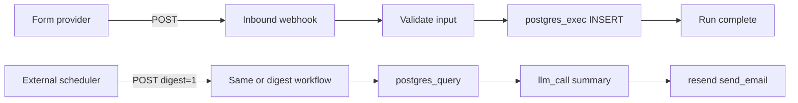

Build a pipeline that **ingests form data**, **persists it in Postgres**, and **emails a digest** to your team. Runs are triggered by an [inbound webhook](/integrations/inbound-webhooks); a separate scheduled trigger (external cron → same workflow or a digest-only variant) can send the daily email.

## What you'll build



**Outcome:** Every submission is stored with a timestamp. Once per day, stakeholders receive an HTML email listing new leads or tickets.

## Prerequisites

- **project_contributor** in your workspace
- [Postgres connection](/connectors/postgres) with INSERT and SELECT on a `form_submissions` table
- [Resend connection](/connectors/resend) with a verified sending domain
- An LLM provider configured in **Providers** (for the digest narrative)
- Inbound webhook feature enabled for your environment

### Create the table

Run once against your database:

```sql
CREATE TABLE IF NOT EXISTS form_submissions (
  id SERIAL PRIMARY KEY,
  email TEXT NOT NULL,
  name TEXT,
  message TEXT,
  source TEXT DEFAULT 'webhook',
  created_at TIMESTAMPTZ DEFAULT NOW()
);
```

## Connectors to install

| Adapter | Purpose |
|---------|---------|
| [postgres](/connectors/postgres) | Store and query submissions |
| [resend](/connectors/resend) | Send digest email |

## Part 1 — Ingest submissions

<Steps>
  <Step title="Create the ingest workflow">
    In **Workflow Studio**, create a workflow named `form-submission-ingest`.
  </Step>
  <Step title="Add validate step">
    Add a **lua_script** step that requires `email` and normalizes input from the webhook body.
  </Step>
  <Step title="Add Postgres insert">
    Add **mcp_call** → `postgres_exec` on your `postgres` instance to INSERT a row.
  </Step>
  <Step title="Create webhook subscription">
    Link an [inbound webhook](/integrations/inbound-webhooks) subscription to this workflow. Configure your form tool (Typeform, Webflow, custom app) to POST JSON to the subscription URL.
  </Step>
  <Step title="Test">
    Submit a test form. Confirm a row appears in `form_submissions` and the run succeeds in Command Center.
  </Step>
</Steps>

### Validate step

```json
{
  "id": "validate",
  "type": "lua_script",
  "name": "Validate submission",
  "script": "if not input.email or input.email == '' then error('email required') end\nreturn {\n  email = input.email,\n  name = input.name or '',\n  message = input.message or '',\n  source = input.source or 'webhook'\n}",
  "timeout_s": 10
}
```

### Insert step

```json
{
  "id": "insert-row",
  "type": "mcp_call",
  "name": "Save submission",
  "tool_name": "postgres_exec",
  "tool_args": {
    "sql": "INSERT INTO form_submissions (email, name, message, source) VALUES ($1, $2, $3, $4)",
    "args": [
      "{{steps.validate.result.email}}",
      "{{steps.validate.result.name}}",
      "{{steps.validate.result.message}}",
      "{{steps.validate.result.source}}"
    ]
  },
  "depends_on": ["validate"],
  "timeout_s": 30
}
```

### Webhook payload example

Your form should POST fields that map to workflow `input`:

```json
{
  "email": "alex@example.com",
  "name": "Alex Kim",
  "message": "Interested in enterprise plan",
  "source": "landing-page"
}
```

## Part 2 — Daily digest email

Create a second workflow `form-daily-digest` (or branch on `input.digest` in one graph).

<Steps>
  <Step title="Query last 24 hours">
    **mcp_call** → `postgres_query` for rows where `created_at > NOW() - INTERVAL '1 day'`.
  </Step>
  <Step title="Summarize with LLM">
    **llm_call** with a prompt that includes `{{steps.query-submissions.result.rows}}` and asks for a short HTML bullet list.
  </Step>
  <Step title="Send email">
    **mcp_call** → `send_email` on your `resend` instance with `html` from the LLM step.
  </Step>
  <Step title="Schedule externally">
    Use GitHub Actions, cron, or your cloud scheduler to POST to the digest webhook URL once per day (see [Workflow patterns](/workflows/patterns#inbound-webhook-triggers)).
  </Step>
</Steps>

### Query step

```json
{
  "id": "query-submissions",
  "type": "mcp_call",
  "name": "Fetch today's submissions",
  "tool_name": "postgres_query",
  "tool_args": {
    "sql": "SELECT email, name, message, source, created_at FROM form_submissions WHERE created_at >= NOW() - INTERVAL '1 day' ORDER BY created_at DESC"
  },
  "timeout_s": 30
}
```

### LLM step

```json
{
  "id": "summarize",
  "type": "llm_call",
  "name": "Write digest narrative",
  "model": "gpt-4o-mini",
  "prompt": "You are an ops assistant. Given these form submissions as JSON, write a concise HTML email body with a bullet per submission (email, name, message). Submissions: {{steps.query-submissions.result.rows}}",
  "depends_on": ["query-submissions"],
  "timeout_s": 120
}
```

### Send step

```json
{
  "id": "send-digest",
  "type": "mcp_call",
  "name": "Email team digest",
  "tool_name": "send_email",
  "tool_args": {
    "to": "team@example.com",
    "subject": "Daily form submissions — {{input.report_date}}",
    "html": "{{steps.summarize.result.text}}"
  },
  "depends_on": ["summarize"],
  "timeout_s": 30
}
```

## Full workflow graphs (copy-paste)

Bind your `postgres` and `resend` MCP instances on each `mcp_call` step in Workflow Studio.

### Ingest workflow (`form-submission-ingest`)

```json
{
  "tenant_id": "your-workspace-slug",
  "workflow_id": "550e8400-e29b-41d4-a716-446655440020",
  "params": {},
  "steps": [
    {
      "id": "validate",
      "type": "lua_script",
      "name": "Validate submission",
      "script": "if not input.email or input.email == '' then error('email required') end\nreturn {\n  email = input.email,\n  name = input.name or '',\n  message = input.message or '',\n  source = input.source or 'webhook'\n}",
      "timeout_s": 10
    },
    {
      "id": "insert-row",
      "type": "mcp_call",
      "name": "Save submission",
      "tool_name": "postgres_exec",
      "tool_args": {
        "sql": "INSERT INTO form_submissions (email, name, message, source) VALUES ($1, $2, $3, $4)",
        "args": [
          "{{steps.validate.result.email}}",
          "{{steps.validate.result.name}}",
          "{{steps.validate.result.message}}",
          "{{steps.validate.result.source}}"
        ]
      },
      "depends_on": ["validate"],
      "timeout_s": 30
    }
  ]
}
```

### Digest workflow (`form-daily-digest`)

```json
{
  "tenant_id": "your-workspace-slug",
  "workflow_id": "550e8400-e29b-41d4-a716-446655440021",
  "params": {},
  "steps": [
    {
      "id": "query-submissions",
      "type": "mcp_call",
      "name": "Fetch today's submissions",
      "tool_name": "postgres_query",
      "tool_args": {
        "sql": "SELECT email, name, message, source, created_at FROM form_submissions WHERE created_at >= NOW() - INTERVAL '1 day' ORDER BY created_at DESC"
      },
      "timeout_s": 30
    },
    {
      "id": "summarize",
      "type": "llm_call",
      "name": "Write digest narrative",
      "model": "gpt-4o-mini",
      "prompt": "You are an ops assistant. Given these form submissions as JSON, write a concise HTML email body with a bullet per submission (email, name, message). Submissions: {{steps.query-submissions.result.rows}}",
      "depends_on": ["query-submissions"],
      "timeout_s": 120
    },
    {
      "id": "send-digest",
      "type": "mcp_call",
      "name": "Email team digest",
      "tool_name": "send_email",
      "tool_args": {
        "to": "team@example.com",
        "subject": "Daily form submissions — {{input.report_date}}",
        "html": "{{steps.summarize.result.text}}"
      },
      "depends_on": ["summarize"],
      "timeout_s": 30
    }
  ]
}
```

Wire the ingest workflow to your form webhook URL. Schedule the digest workflow with an external cron POST — see [Inbound webhooks](/integrations/inbound-webhooks).

## Idempotency

Form providers may retry webhooks. Options:

- Add a unique `submission_id` column and use `ON CONFLICT DO NOTHING`
- Check for duplicate email + timestamp in a Lua step before INSERT

## Variations

- Swap Resend for [Gmail](/connectors/gmail) if you prefer sending from a Google mailbox.
- Append rows to [Google Sheets](/connectors/google-sheets) instead of Postgres for a no-DB setup.
- Add **human_task** approval before the digest sends on Mondays only.

## Related

- [Postgres connector](/connectors/postgres)
- [Resend connector](/connectors/resend)
- [Inbound webhooks](/integrations/inbound-webhooks)
- [All guides](/guides/overview)
