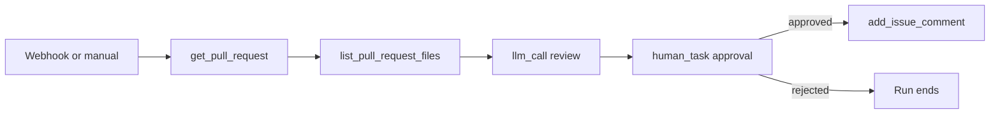

Automate first-pass **pull request reviews** without posting unreviewed AI text to your repo. The workflow fetches PR metadata and diffs, drafts a review with an LLM, pauses for **human approval** in Command Center, then posts an approved comment on GitHub.

## What you'll build



**Outcome:** Reviewers see a structured summary in Command Center, edit or reject it, and only approved text is published as a GitHub comment.

## Prerequisites

- **project_contributor** access
- [GitHub personal access token](/connectors/github) with `repo` scope on target repositories
- LLM provider configured in **Providers**
- Optional: inbound webhook from GitHub (`pull_request` events) or manual runs with `owner`, `repo`, `pr_number`

## Connectors to install

| Adapter | Purpose |
|---------|---------|
| [github](/connectors/github) | Read PR, list files, post comment |

## Build the workflow

<Steps>
  <Step title="Create workflow">
    Name it `github-pr-review` in **Workflow Studio**.
  </Step>
  <Step title="Validate input">
    **lua_script** requires `owner`, `repo`, and `pr_number`.
  </Step>
  <Step title="Fetch PR and files">
    Chain **mcp_call** → `get_pull_request` then `list_pull_request_files`.
  </Step>
  <Step title="LLM review">
    **llm_call** with PR title, body, and file list in the prompt. Ask for risks, test gaps, and a suggested comment body.
  </Step>
  <Step title="Human approval">
    **human_task** with `task_type: "approval"` showing the draft comment. See [Human tasks](/workflows/human-tasks).
  </Step>
  <Step title="Post comment">
    **mcp_call** → `add_issue_comment` using the LLM draft text, gated by `{{steps.approve-review.result.approved}}`.
  </Step>
  <Step title="Trigger">
    Start runs manually, via API, or wire a GitHub webhook to an [inbound subscription](/integrations/inbound-webhooks) that maps `pull_request.number` to `pr_number`.
  </Step>
</Steps>

### Validate input

```json
{
  "id": "validate",
  "type": "lua_script",
  "name": "Validate PR coordinates",
  "script": "if not input.owner or not input.repo or not input.pr_number then error('owner, repo, pr_number required') end\nreturn {\n  owner = input.owner,\n  repo = input.repo,\n  pr_number = tonumber(input.pr_number)\n}",
  "timeout_s": 10
}
```

### Fetch PR

```json
{
  "id": "get-pr",
  "type": "mcp_call",
  "name": "Get pull request",
  "tool_name": "get_pull_request",
  "tool_args": {
    "owner": "{{steps.validate.result.owner}}",
    "repo": "{{steps.validate.result.repo}}",
    "pull_number": "{{steps.validate.result.pr_number}}"
  },
  "depends_on": ["validate"],
  "timeout_s": 30
}
```

### List changed files

```json
{
  "id": "list-files",
  "type": "mcp_call",
  "name": "List PR files",
  "tool_name": "list_pull_request_files",
  "tool_args": {
    "owner": "{{steps.validate.result.owner}}",
    "repo": "{{steps.validate.result.repo}}",
    "pull_number": "{{steps.validate.result.pr_number}}"
  },
  "depends_on": ["get-pr"],
  "timeout_s": 30
}
```

### LLM review

```json
{
  "id": "draft-review",
  "type": "llm_call",
  "name": "Draft PR review",
  "model": "gpt-4o",
  "prompt": "You are a senior engineer reviewing a pull request.\n\nTitle: {{steps.get-pr.result.title}}\nDescription: {{steps.get-pr.result.body}}\nFiles changed: {{steps.list-files.result}}\n\nWrite a concise review comment (markdown) covering: summary, risks, testing suggestions, and approval recommendation. Output only the comment body.",
  "depends_on": ["list-files"],
  "timeout_s": 180
}
```

### Human approval

```json
{
  "id": "approve-review",
  "type": "human_task",
  "name": "Approve review comment",
  "task_type": "approval",
  "task_payload": {
    "title": "Post PR review on {{steps.validate.result.owner}}/{{steps.validate.result.repo}}#{{steps.validate.result.pr_number}}",
    "description": "Edit or reject before posting to GitHub.",
    "draft_body": "{{steps.draft-review.result.text}}"
  },
  "depends_on": ["draft-review"],
  "timeout_s": 86400
}
```

### Post comment

```json
{
  "id": "post-comment",
  "type": "mcp_call",
  "name": "Add GitHub comment",
  "tool_name": "add_issue_comment",
  "tool_args": {
    "owner": "{{steps.validate.result.owner}}",
    "repo": "{{steps.validate.result.repo}}",
    "issue_number": "{{steps.validate.result.pr_number}}",
    "body": "{{steps.draft-review.result.text}}"
  },
  "depends_on": ["approve-review"],
  "condition": "{{steps.approve-review.result.approved}}",
  "timeout_s": 30
}
```

<Note>
  Command **Approve** only sets `approved: true` on the human task step — it does not copy `draft_body` into the result. Reference the LLM step for comment text, or complete the task via API with a custom `result` object. See [Human tasks](/workflows/human-tasks#what-downstream-steps-receive).
</Note>

## Full workflow graph (copy-paste)

Replace `tenant_id`, `workflow_id`, and bind your `github` MCP instance on each `mcp_call` step in Workflow Studio (instance picker sets `server_url` at publish time).

```json
{
  "tenant_id": "your-workspace-slug",
  "workflow_id": "550e8400-e29b-41d4-a716-446655440010",
  "params": {},
  "steps": [
    {
      "id": "validate",
      "type": "lua_script",
      "name": "Validate PR coordinates",
      "script": "if not input.owner or not input.repo or not input.pr_number then error('owner, repo, pr_number required') end\nreturn {\n  owner = input.owner,\n  repo = input.repo,\n  pr_number = tonumber(input.pr_number)\n}",
      "timeout_s": 10
    },
    {
      "id": "get-pr",
      "type": "mcp_call",
      "name": "Get pull request",
      "tool_name": "get_pull_request",
      "tool_args": {
        "owner": "{{steps.validate.result.owner}}",
        "repo": "{{steps.validate.result.repo}}",
        "pull_number": "{{steps.validate.result.pr_number}}"
      },
      "depends_on": ["validate"],
      "timeout_s": 30
    },
    {
      "id": "list-files",
      "type": "mcp_call",
      "name": "List PR files",
      "tool_name": "list_pull_request_files",
      "tool_args": {
        "owner": "{{steps.validate.result.owner}}",
        "repo": "{{steps.validate.result.repo}}",
        "pull_number": "{{steps.validate.result.pr_number}}"
      },
      "depends_on": ["get-pr"],
      "timeout_s": 30
    },
    {
      "id": "draft-review",
      "type": "llm_call",
      "name": "Draft PR review",
      "model": "gpt-4o",
      "prompt": "You are a senior engineer reviewing a pull request.\n\nTitle: {{steps.get-pr.result.title}}\nDescription: {{steps.get-pr.result.body}}\nFiles changed: {{steps.list-files.result}}\n\nWrite a concise review comment (markdown) covering: summary, risks, testing suggestions, and approval recommendation. Output only the comment body.",
      "depends_on": ["list-files"],
      "timeout_s": 180
    },
    {
      "id": "approve-review",
      "type": "human_task",
      "name": "Approve review comment",
      "task_type": "approval",
      "task_payload": {
        "title": "Post PR review on {{steps.validate.result.owner}}/{{steps.validate.result.repo}}#{{steps.validate.result.pr_number}}",
        "description": "Review the draft in Command Center. Reject to cancel the GitHub comment.",
        "draft_body": "{{steps.draft-review.result.text}}"
      },
      "depends_on": ["draft-review"],
      "timeout_s": 86400
    },
    {
      "id": "post-comment",
      "type": "mcp_call",
      "name": "Add GitHub comment",
      "tool_name": "add_issue_comment",
      "tool_args": {
        "owner": "{{steps.validate.result.owner}}",
        "repo": "{{steps.validate.result.repo}}",
        "issue_number": "{{steps.validate.result.pr_number}}",
        "body": "{{steps.draft-review.result.text}}"
      },
      "depends_on": ["approve-review"],
      "condition": "{{steps.approve-review.result.approved}}",
      "timeout_s": 30
    }
  ]
}
```

Start a run via **Workflow Studio** or:

```
POST /v1/workflows/{id}/command
{ "command": "start", "params": { "owner": "your-org", "repo": "your-repo", "pr_number": 42 } }
```

## Test run

Start a manual run:

```json
{
  "owner": "your-org",
  "repo": "your-repo",
  "pr_number": 42
}
```

Open **Command Center**, approve or edit the draft, then confirm the comment appears on the PR.

## Variations

- Add `compare_commits` for larger diff context before the LLM step.
- Route low-confidence reviews: Lua checks for "BLOCK" in LLM output → always require human task.
- On approval, call `merge_pull_request` instead of commenting (separate workflow with stricter gates).

## Related

- [GitHub connector](/connectors/github)
- [Approve then send](/workflows/patterns#approve-then-send)
- [Command Center](/workflows/command-center)
- [All guides](/guides/overview)
