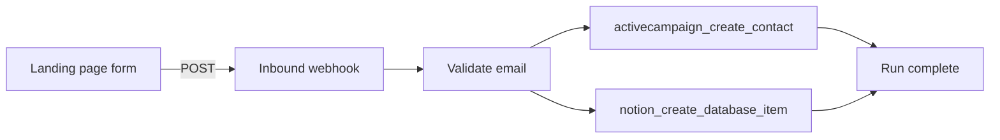

When a lead form submits, **create or update a CRM contact** in ActiveCampaign and **append a row** to a Notion database for your team to track. One webhook trigger drives both MCP calls in parallel after validation.

## What you'll build



**Outcome:** Marketing automation receives the lead immediately; sales sees the same submission in Notion with source and timestamp.

## Prerequisites

- **project_contributor** access
- [ActiveCampaign API URL and token](/connectors/activecampaign)
- [Notion integration token](/connectors/notion) with target database shared to the integration
- Notion database with properties: **Name** (title), **Email** (email), **Source** (select or text), **Status** (select, default `New`)
- Inbound webhook subscription

## Connectors to install

| Adapter | Purpose |
|---------|---------|
| [activecampaign](/connectors/activecampaign) | Create CRM contact and subscribe to list |
| [notion](/connectors/notion) | Log submission in team database |

## Build the workflow

<Steps>
  <Step title="Discover Notion database ID">
    Run **mcp_call** → `notion_search` and copy the database UUID for your leads table.
  </Step>
  <Step title="Create workflow">
    Name it `lead-sync-ac-notion` in **Workflow Studio**.
  </Step>
  <Step title="Validate input">
    **lua_script** requires `email`; normalize `first_name`, `last_name`, `source`.
  </Step>
  <Step title="Create ActiveCampaign contact">
    **mcp_call** → `activecampaign_create_contact` with optional `field_values_json` for custom fields.
  </Step>
  <Step title="Log in Notion">
    **mcp_call** → `notion_create_database_item` in parallel (same `depends_on` as validate) or after AC — both are valid.
  </Step>
  <Step title="Subscribe to list (optional)">
    Add **mcp_call** → `activecampaign_subscribe_or_unsubscribe_contact_from_list` after contact creation.
  </Step>
  <Step title="Wire form webhook">
    Point your landing page form at the inbound webhook URL.
  </Step>
</Steps>

### Validate input

```json
{
  "id": "validate",
  "type": "lua_script",
  "name": "Validate lead",
  "script": "if not input.email or input.email == '' then error('email required') end\nreturn {\n  email = input.email,\n  first_name = input.first_name or '',\n  last_name = input.last_name or '',\n  source = input.source or 'website'\n}",
  "timeout_s": 10
}
```

### ActiveCampaign contact

```json
{
  "id": "create-contact",
  "type": "mcp_call",
  "name": "Create AC contact",
  "tool_name": "activecampaign_create_contact",
  "tool_args": {
    "email": "{{steps.validate.result.email}}",
    "first_name": "{{steps.validate.result.first_name}}",
    "last_name": "{{steps.validate.result.last_name}}",
    "field_values_json": "[{\"field\":\"1\",\"value\":\"{{steps.validate.result.source}}\"}]"
  },
  "depends_on": ["validate"],
  "timeout_s": 30
}
```

Replace field `1` with your ActiveCampaign custom field ID for lead source.

### Notion log row

```json
{
  "id": "log-notion",
  "type": "mcp_call",
  "name": "Log lead in Notion",
  "tool_name": "notion_create_database_item",
  "tool_args": {
    "database_id": "your-database-uuid",
    "properties_json": "{\"Name\":{\"title\":[{\"text\":{\"content\":\"{{steps.validate.result.first_name}} {{steps.validate.result.last_name}}\"}}]},\"Email\":{\"email\":\"{{steps.validate.result.email}}\"},\"Source\":{\"select\":{\"name\":\"{{steps.validate.result.source}}\"}},\"Status\":{\"select\":{\"name\":\"New\"}}}"
  },
  "depends_on": ["validate"],
  "timeout_s": 30
}
```

Use `notion_retrieve_database` to confirm exact property names and types before publishing.

### Subscribe to nurture list (optional)

```json
{
  "id": "subscribe-list",
  "type": "mcp_call",
  "name": "Add to nurture list",
  "tool_name": "activecampaign_subscribe_or_unsubscribe_contact_from_list",
  "tool_args": {
    "contact_id": "{{steps.create-contact.result.contact.id}}",
    "list_id": "12",
    "subscribe": true
  },
  "depends_on": ["create-contact"],
  "timeout_s": 30
}
```

## Full workflow graph (copy-paste)

Replace `your-database-uuid`, ActiveCampaign field ID `1`, and list ID `12`. Bind `activecampaign` and `notion` MCP instances on each `mcp_call` step.

```json
{
  "tenant_id": "your-workspace-slug",
  "workflow_id": "550e8400-e29b-41d4-a716-446655440050",
  "params": {},
  "steps": [
    {
      "id": "validate",
      "type": "lua_script",
      "name": "Validate lead",
      "script": "if not input.email or input.email == '' then error('email required') end\nreturn {\n  email = input.email,\n  first_name = input.first_name or '',\n  last_name = input.last_name or '',\n  source = input.source or 'website'\n}",
      "timeout_s": 10
    },
    {
      "id": "create-contact",
      "type": "mcp_call",
      "name": "Create AC contact",
      "tool_name": "activecampaign_create_contact",
      "tool_args": {
        "email": "{{steps.validate.result.email}}",
        "first_name": "{{steps.validate.result.first_name}}",
        "last_name": "{{steps.validate.result.last_name}}",
        "field_values_json": "[{\"field\":\"1\",\"value\":\"{{steps.validate.result.source}}\"}]"
      },
      "depends_on": ["validate"],
      "timeout_s": 30
    },
    {
      "id": "log-notion",
      "type": "mcp_call",
      "name": "Log lead in Notion",
      "tool_name": "notion_create_database_item",
      "tool_args": {
        "database_id": "your-database-uuid",
        "properties_json": "{\"Name\":{\"title\":[{\"text\":{\"content\":\"{{steps.validate.result.first_name}} {{steps.validate.result.last_name}}\"}}]},\"Email\":{\"email\":\"{{steps.validate.result.email}}\"},\"Source\":{\"select\":{\"name\":\"{{steps.validate.result.source}}\"}},\"Status\":{\"select\":{\"name\":\"New\"}}}"
      },
      "depends_on": ["validate"],
      "timeout_s": 30
    },
    {
      "id": "subscribe-list",
      "type": "mcp_call",
      "name": "Add to nurture list",
      "tool_name": "activecampaign_subscribe_or_unsubscribe_contact_from_list",
      "tool_args": {
        "contact_id": "{{steps.create-contact.result.contact.id}}",
        "list_id": "12",
        "subscribe": true
      },
      "depends_on": ["create-contact"],
      "timeout_s": 30
    }
  ]
}
```

`log-notion` and `create-contact` both depend on `validate`, so they run in parallel after validation.

## Idempotency

Duplicate webhook deliveries may create duplicate Notion rows. Mitigations:

- Store `submission_id` in Notion and skip if `notion_find_database_item` finds a match
- Use ActiveCampaign's duplicate handling — update with `activecampaign_update_contact` when email exists

## Variations

- Add **llm_call** to score lead intent → `activecampaign_add_tag_to_contact` with `hot` / `warm` / `cold`.
- Notify sales on Slack (when messaging tools ship) or [Resend](/connectors/resend) email for `hot` leads only.
- Replace Notion with [Google Sheets](/connectors/google-sheets) `insert_row` for a lighter log.

## Related

- [ActiveCampaign connector](/connectors/activecampaign)
- [Notion connector](/connectors/notion)
- [Inbound webhooks](/integrations/inbound-webhooks)
- [All guides](/guides/overview)
