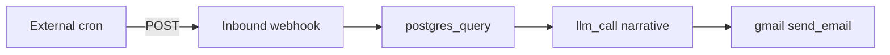

Send a **weekly operational report** pulled from Postgres, narrated by an LLM, and delivered by Gmail. AgentRuntime does not run cron internally — an external scheduler fires an [inbound webhook](/integrations/inbound-webhooks) or API call on your timetable.

## What you'll build



**Outcome:** Every Monday morning, finance or ops receives a Gmail message with KPIs and plain-language commentary sourced from your database.

## Prerequisites

- **project_contributor** access
- [Postgres connection](/connectors/postgres) with read-only user for reporting queries
- [Google connection](/integrations/google-workspace) with Gmail enabled
- LLM provider in **Providers**
- External scheduler (GitHub Actions, Cloud Scheduler, cron) that can POST to your webhook URL weekly

## Connectors to install

| Adapter | Purpose |
|---------|---------|
| [postgres](/connectors/postgres) | Run reporting SQL |
| [gmail](/connectors/gmail) | Send email from your Google account |

## Example report query

Adjust to your schema — this example aggregates orders:

```sql
SELECT
  DATE_TRUNC('week', created_at) AS week,
  COUNT(*) AS order_count,
  SUM(total)::numeric(12,2) AS revenue
FROM orders
WHERE created_at >= NOW() - INTERVAL '7 days'
GROUP BY 1
ORDER BY 1 DESC;
```

## Build the workflow

<Steps>
  <Step title="Create workflow">
    Name it `weekly-ops-report` in **Workflow Studio**.
  </Step>
  <Step title="Query Postgres">
    **mcp_call** → `postgres_query` with your weekly SQL. Use a read-only DB user.
  </Step>
  <Step title="LLM narrative">
    **llm_call** turns row JSON into an executive summary with highlights and anomalies.
  </Step>
  <Step title="Send via Gmail">
    **mcp_call** → `send_email` to distribution list with subject line including the week ending date.
  </Step>
  <Step title="Schedule">
    Configure external cron to POST `{}` or `{"report_week": "2026-W23"}` to your inbound webhook each Monday 08:00 UTC.
  </Step>
  <Step title="Optional approval">
    Insert **human_task** between LLM and Gmail for regulated reports — see [Approve then send](/workflows/patterns#approve-then-send).
  </Step>
</Steps>

### Query step

```json
{
  "id": "weekly-metrics",
  "type": "mcp_call",
  "name": "Fetch weekly KPIs",
  "tool_name": "postgres_query",
  "tool_args": {
    "sql": "SELECT DATE_TRUNC('week', created_at) AS week, COUNT(*) AS order_count, SUM(total)::numeric(12,2) AS revenue FROM orders WHERE created_at >= NOW() - INTERVAL '7 days' GROUP BY 1 ORDER BY 1 DESC"
  },
  "timeout_s": 60,
  "retry_count": 2
}
```

### LLM step

```json
{
  "id": "write-summary",
  "type": "llm_call",
  "name": "Executive summary",
  "model": "gpt-4o-mini",
  "prompt": "You are a business analyst. Given this weekly metrics JSON from our database, write a concise email body (plain text, 3-5 short paragraphs) for leadership. Call out week-over-week changes if visible. Data: {{steps.weekly-metrics.result.rows}}",
  "depends_on": ["weekly-metrics"],
  "timeout_s": 120
}
```

### Gmail step

```json
{
  "id": "send-report",
  "type": "mcp_call",
  "name": "Email weekly report",
  "tool_name": "send_email",
  "tool_args": {
    "to": "leadership@example.com",
    "subject": "Weekly ops report — week ending {{input.report_week}}",
    "body": "{{steps.write-summary.result.text}}"
  },
  "depends_on": ["write-summary"],
  "timeout_s": 30
}
```

## Full workflow graph (copy-paste)

Bind your `postgres` and `gmail` MCP instances. Adjust the SQL and recipient list before publishing.

```json
{
  "tenant_id": "your-workspace-slug",
  "workflow_id": "550e8400-e29b-41d4-a716-446655440040",
  "params": {},
  "steps": [
    {
      "id": "weekly-metrics",
      "type": "mcp_call",
      "name": "Fetch weekly KPIs",
      "tool_name": "postgres_query",
      "tool_args": {
        "sql": "SELECT DATE_TRUNC('week', created_at) AS week, COUNT(*) AS order_count, SUM(total)::numeric(12,2) AS revenue FROM orders WHERE created_at >= NOW() - INTERVAL '7 days' GROUP BY 1 ORDER BY 1 DESC"
      },
      "timeout_s": 60,
      "retry_count": 2
    },
    {
      "id": "write-summary",
      "type": "llm_call",
      "name": "Executive summary",
      "model": "gpt-4o-mini",
      "prompt": "You are a business analyst. Given this weekly metrics JSON from our database, write a concise email body (plain text, 3-5 short paragraphs) for leadership. Call out week-over-week changes if visible. Data: {{steps.weekly-metrics.result.rows}}",
      "depends_on": ["weekly-metrics"],
      "timeout_s": 120
    },
    {
      "id": "send-report",
      "type": "mcp_call",
      "name": "Email weekly report",
      "tool_name": "send_email",
      "tool_args": {
        "to": "leadership@example.com",
        "subject": "Weekly ops report — week ending {{input.report_week}}",
        "body": "{{steps.write-summary.result.text}}"
      },
      "depends_on": ["write-summary"],
      "timeout_s": 30
    }
  ]
}
```

Trigger weekly via inbound webhook or `POST /v1/workflows/{id}/command` with `{ "command": "start", "params": { "report_week": "2026-W23" } }`.

## Schedule with GitHub Actions (example)

```yaml
name: Weekly report trigger
on:
  schedule:
    - cron: "0 8 * * 1"
jobs:
  trigger:
    runs-on: ubuntu-latest
    steps:
      - run: |
          curl -X POST "$WEBHOOK_URL" \
            -H "Content-Type: application/json" \
            -d '{"report_week": "'"$(date +%G-W%V)"'"}'
```

Store the webhook URL and signing headers per [Inbound webhooks](/integrations/inbound-webhooks).

## Variations

- Export raw CSV with `postgres_query` → attach via a future file step, or write to [Google Sheets](/connectors/google-sheets) with `insert_multiple_rows`.
- Swap Gmail for [Resend](/connectors/resend) for transactional sending from a verified domain.
- Chain multiple queries (revenue, support tickets, churn) before one LLM step.

## Related

- [Postgres connector](/connectors/postgres)
- [Gmail connector](/connectors/gmail)
- [Workflow patterns — scheduled report](/workflows/patterns#inbound-webhook-triggers)
- [All guides](/guides/overview)
