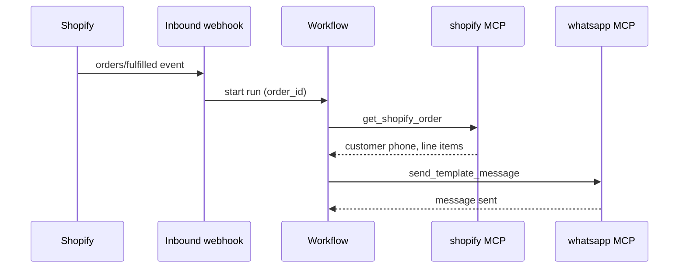

Notify customers on WhatsApp when their **Shopify order ships**. The workflow is triggered by a Shopify webhook (or manual test), fetches order details, and sends an approved **template message** — required for outbound WhatsApp outside the 24-hour session window.

## What you'll build



**Outcome:** Customers receive a branded WhatsApp message with order number and tracking context when fulfillment completes.

## Prerequisites

- **project_contributor** access
- [Shopify Admin API token](/connectors/shopify) with `read_orders` scope
- [WhatsApp Business](/connectors/whatsapp) connection (WABA, phone number ID, access token)
- At least one **APPROVED** WhatsApp template (e.g. `order_shipped` with `{{1}}` = order name, `{{2}}` = tracking URL)
- Customer phone numbers stored on Shopify orders (E.164 format, e.g. `+14155551234`)
- Inbound webhook subscription for your project

<Warning>
  Use `send_template_message` for proactive shipping updates. `send_message` only works within 24 hours of the customer's last inbound message unless you are replying in an open session.
</Warning>

## Connectors to install

| Adapter | Purpose |
|---------|---------|
| [shopify](/connectors/shopify) | Fetch order and customer details |
| [whatsapp](/connectors/whatsapp) | Send template message |

## Setup WhatsApp template

<Steps>
  <Step title="List templates">
    Run a test workflow with **mcp_call** → `list_message_templates` and note an `APPROVED` template name and language code (e.g. `en_US`).
  </Step>
  <Step title="Match parameters">
    Align template placeholders with `tool_args` — typically order ID, tracking link, or customer name.
  </Step>
</Steps>

## Build the workflow

<Steps>
  <Step title="Create workflow">
    Name it `shopify-order-shipped-whatsapp` in **Workflow Studio**.
  </Step>
  <Step title="Validate webhook input">
    Require `order_id` from the Shopify webhook payload via a **lua_script** step.
  </Step>
  <Step title="Fetch order">
    **mcp_call** → `get_shopify_order` with the order ID.
  </Step>
  <Step title="Extract phone">
    **lua_script** reads customer phone from the Shopify response. Fail clearly if missing.
  </Step>
  <Step title="Send template">
    **mcp_call** → `send_template_message` with template name and body parameters.
  </Step>
  <Step title="Wire Shopify webhook">
    In Shopify Admin → **Settings → Notifications → Webhooks**, create a webhook for **Order fulfillment** pointing at your AgentRuntime inbound URL.
  </Step>
</Steps>

### Validate input

```json
{
  "id": "validate",
  "type": "lua_script",
  "name": "Require order_id",
  "script": "local id = input.order_id or input.id\nif not id then error('order_id required') end\nreturn { order_id = tostring(id) }",
  "timeout_s": 10
}
```

Map Shopify's payload in your subscription so `order_id` reaches workflow input (field names vary by webhook version — test with a sample POST).

### Fetch order

```json
{
  "id": "get-order",
  "type": "mcp_call",
  "name": "Get Shopify order",
  "tool_name": "get_shopify_order",
  "tool_args": {
    "order_id": "{{steps.validate.result.order_id}}"
  },
  "depends_on": ["validate"],
  "timeout_s": 30,
  "retry_count": 2
}
```

### Extract customer phone

```json
{
  "id": "extract-phone",
  "type": "lua_script",
  "name": "Get E.164 phone",
  "script": "local order = steps['get-order'].result\nlocal phone = order.phone or (order.customer and order.customer.phone)\nif not phone or phone == '' then error('no phone on order') end\nreturn { phone = phone, order_name = order.name or order.id }",
  "depends_on": ["get-order"],
  "timeout_s": 10
}
```

### Send WhatsApp template

```json
{
  "id": "notify-customer",
  "type": "mcp_call",
  "name": "WhatsApp shipping update",
  "tool_name": "send_template_message",
  "tool_args": {
    "to": "{{steps.extract-phone.result.phone}}",
    "template_name": "order_shipped",
    "language_code": "en_US",
    "body_parameters": [
      "{{steps.extract-phone.result.order_name}}",
      "https://your-store.com/pages/tracking"
    ]
  },
  "depends_on": ["extract-phone"],
  "timeout_s": 30
}
```

Adjust `body_parameters` to match your template's placeholder count and order.

## Full workflow graph (copy-paste)

Bind your `shopify` and `whatsapp` MCP instances on each `mcp_call` step. Replace `template_name`, `language_code`, and `body_parameters` to match your approved WhatsApp template.

```json
{
  "tenant_id": "your-workspace-slug",
  "workflow_id": "550e8400-e29b-41d4-a716-446655440030",
  "params": {},
  "steps": [
    {
      "id": "validate",
      "type": "lua_script",
      "name": "Require order_id",
      "script": "local id = input.order_id or input.id\nif not id then error('order_id required') end\nreturn { order_id = tostring(id) }",
      "timeout_s": 10
    },
    {
      "id": "get-order",
      "type": "mcp_call",
      "name": "Get Shopify order",
      "tool_name": "get_shopify_order",
      "tool_args": {
        "order_id": "{{steps.validate.result.order_id}}"
      },
      "depends_on": ["validate"],
      "timeout_s": 30,
      "retry_count": 2
    },
    {
      "id": "extract-phone",
      "type": "lua_script",
      "name": "Get E.164 phone",
      "script": "local order = steps['get-order'].result\nlocal phone = order.phone or (order.customer and order.customer.phone)\nif not phone or phone == '' then error('no phone on order') end\nreturn { phone = phone, order_name = order.name or order.id }",
      "depends_on": ["get-order"],
      "timeout_s": 10
    },
    {
      "id": "notify-customer",
      "type": "mcp_call",
      "name": "WhatsApp shipping update",
      "tool_name": "send_template_message",
      "tool_args": {
        "to": "{{steps.extract-phone.result.phone}}",
        "template_name": "order_shipped",
        "language_code": "en_US",
        "body_parameters": [
          "{{steps.extract-phone.result.order_name}}",
          "https://your-store.com/pages/tracking"
        ]
      },
      "depends_on": ["extract-phone"],
      "timeout_s": 30
    }
  ]
}
```

## Test without Shopify

Start a manual run with input:

```json
{
  "order_id": "5678901234"
}
```

Use a test order in dev mode and a WhatsApp [test recipient number](https://developers.facebook.com/docs/whatsapp/cloud-api/get-started#test-numbers) registered in Meta.

## Variations

- Add **human_task** approval before send for high-value orders.
- Write a row to [Postgres](/connectors/postgres) after send for an audit log.
- Use `list_shopify_fulfillments` for tracking numbers in template parameters.

## Related

- [Shopify connector](/connectors/shopify)
- [WhatsApp connector](/connectors/whatsapp)
- [Approve then send](/workflows/patterns#approve-then-send)
- [All guides](/guides/overview)
