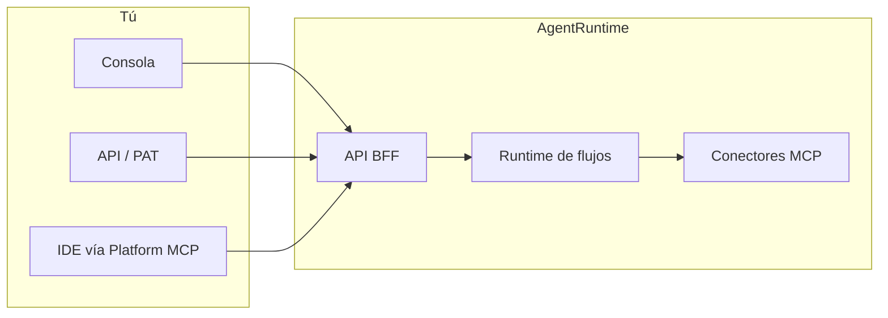

AgentRuntime es una plataforma de orquestación para **agentes de IA en producción**. Diseñas flujos de trabajo de varios pasos en la Consola, conectas herramientas de terceros mediante MCP (Model Context Protocol), ejecutas cargas con reintentos y trazas, y gobiernas el acceso entre inquilinos y proyectos.

Piensa en ello como **Airflow para IA**: ejecución de flujos orientada a eventos con integración nativa de herramientas, no una interfaz de chat genérica.

## Qué puedes hacer

- **Diseñar flujos** en Workflow Studio — grafos dirigidos de llamadas MCP, pasos LLM, scripts Lua, bucles y aprobaciones humanas
- **Conectar herramientas** mediante más de 40 conectores MCP (Google Workspace, bases de datos, Shopify, GitHub y más)
- **Ejecutar con fiabilidad** con validación en dry-run, versionado, pausa/reanudación, reintentos y transmisiones de eventos en vivo
- **Aprobar en el bucle** — las tareas humanas aparecen en Command Center para revisión antes de continuar una ejecución
- **Observar el uso** — ejecuciones en vivo, tasas de éxito, trazas de pasos y consumo de créditos en Analytics
- **Automatizar vía API** — endpoints REST y tokens de acceso personal para CI, scripts e integraciones en el IDE

## Componentes principales

| Componente | Función |
|-----------|---------|
| **Consola** | Interfaz web en [console.agentruntime.io](https://console.agentruntime.io) — Workflow Studio, Command Center, Conexiones, MCP, Proveedores, Chat |
| **API BFF** | API pública en [api.agentruntime.io](https://api.agentruntime.io) — autenticación, flujos, ejecuciones, facturación, integraciones |
| **Runtime de flujos** | Ejecuta grafos de flujos, gestiona paralelismo, reintentos y pausas con humano en el bucle |
| **Capa MCP** | Catálogo de servidores de herramientas; **instancias** por inquilino con perfiles de configuración y enlaces de conexión |
| **Agentes de plataforma** | Definiciones de agentes reutilizables que ejecutan conversaciones de varios turnos en salas de chat y canal |
| **MCP de plataforma** | Expone las APIs de la Consola como herramientas MCP para IDEs en [mcp.agentruntime.io](https://mcp.agentruntime.io/mcp) |

## Cómo funciona en conjunto

## Conceptos clave

- **Espacio de trabajo (inquilino)** — Tu organización. Contiene proyectos, miembros, facturación e integraciones.
- **Proyecto** — Donde viven los flujos, las ejecuciones y las instancias MCP. Los roles se asignan por proyecto.
- **Flujo** — Un DAG versionado de pasos. Se crea en Workflow Studio y se valida antes de publicar.
- **Ejecución** — Una ejecución de una versión publicada del flujo. Transmite eventos por WebSocket.
- **Conexión** — Credenciales guardadas (Google OAuth, WhatsApp, claves API) vinculadas a instancias MCP.
- **Instancia MCP** — Un servidor de herramientas desplegado en tu proyecto con configuración y credenciales conectadas.

Consulta [Conceptos clave](/platform/key-concepts) para el modelo completo, o ve directo a [Inicio rápido](/platform/quickstart) para crear tu primer flujo.

## Para quién es AgentRuntime

AgentRuntime está diseñado para equipos que pasan de experimentos con IA a **cargas de trabajo en producción**:

- Equipos de ingeniería que automatizan operaciones, datos e integraciones con flujos de agentes
- Equipos de producto que necesitan puntos de aprobación humana antes de que los agentes actúen
- Organizaciones que requieren control de acceso multi-inquilino, medición de uso y auditoría

<Note>
  AgentRuntime está orientado a API. La Consola es la interfaz principal para los operadores, pero cada funcionalidad de los flujos también está disponible a través de la API REST y Platform MCP para uso programático.
</Note>
