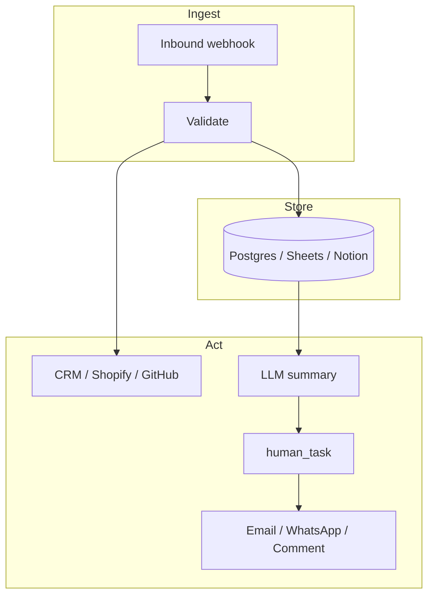

AgentRuntime ships **40 Go MCP adapters**. Each connector has a dedicated page in the **Connectors** section (`/connectors/{slug}`) with authentication, tools, and configuration.

<Note>
  **Integration setup** (connections, MCP instances, webhooks) lives in the pages above this catalog — not on individual connector pages. Connector pages cover only that adapter.
</Note>

## Common patterns

Most production workflows combine a few connectors with LLM and human steps. Start from a pattern, then open the adapter pages for tool names and auth.

| Pattern | Flow | Example guide |
|---------|------|---------------|
| **Webhook → store → notify** | Inbound event → validate → database INSERT → optional digest email | [Form → Postgres → Resend](/guides/form-webhook-postgres-resend-digest) |
| **Event → lookup → message** | External webhook → MCP fetch → customer notification | [Shopify → WhatsApp](/guides/shopify-order-whatsapp) |
| **Fetch → LLM → human → action** | Read source data → draft with LLM → Command Center approval → MCP write | [GitHub PR review](/guides/github-pr-review) |
| **Schedule → query → summarize → email** | External cron → SQL report → LLM narrative → Gmail/Resend | [Postgres weekly report](/guides/scheduled-postgres-gmail-report) |
| **Webhook → CRM + log** | Lead form → CRM contact + parallel audit row (Notion/Sheets) | [Lead sync](/guides/lead-sync-activecampaign-notion) |
| **Approve then send** | Draft → **human_task** → outbound MCP (any channel) | [Workflow patterns](/workflows/patterns#approve-then-send) |

<CardGroup cols={2}>
  <Card title="End-to-end guides" icon="book-open" href="/guides/overview">
    Five full recipes that chain connectors — copy the step graphs into Workflow Studio.
  </Card>
  <Card title="Workflow patterns" icon="workflow" href="/workflows/patterns">
    Approve-then-send, retries, for_each, and webhook idempotency.
  </Card>
</CardGroup>

## Google Workspace

One [Google OAuth connection](/integrations/google-workspace) powers these adapters:

| Connector | Best for | Docs |
|-----------|----------|------|
| Gmail | Transactional email, inbox search, thread replies | [gmail](/connectors/gmail) |
| Google Calendar | Meeting scheduling, availability, event CRUD | [google-calendar](/connectors/google-calendar) |
| Google Docs | Template docs, mail-merge style content | [google-docs](/connectors/google-docs) |
| Google Drive | File upload, sharing, folder automation | [google-drive](/connectors/google-drive) |
| Google Forms | Form creation, response export | [google-form](/connectors/google-form) |
| Google Search | Vertex AI Search / enterprise RAG | [google-search](/connectors/google-search) |
| Google Search Console | SEO analytics, sitemap and URL inspection | [google-search-console](/connectors/google-search-console) |
| Google Sheets | Ops dashboards, CSV sync, reporting tabs | [google-sheets](/connectors/google-sheets) |
| Google Slides | Deck generation from workflow data | [google-slides](/connectors/google-slides) |
| Google Tasks | Follow-up task lists from automations | [google-tasks](/connectors/google-tasks) |

## Communication

| Connector | Best for | Docs |
|-----------|----------|------|
| WhatsApp | Customer notifications, templates, session messaging | [whatsapp](/connectors/whatsapp) |
| Resend | Transactional email from a verified domain | [resend](/connectors/resend) |
| Vapi | Voice agents and phone call orchestration | [vapi](/connectors/vapi) |
| ElevenLabs | Text-to-speech and voice synthesis | [elevenlabs](/connectors/elevenlabs) |
| Slack | Team messaging *(catalog placeholder — tools coming)* | [slack](/connectors/slack) |

## CRM and marketing

| Connector | Best for | Docs |
|-----------|----------|------|
| ActiveCampaign | Contacts, lists, tags, account sync | [activecampaign](/connectors/activecampaign) |
| LinkedIn | Personal and company posts, org admin | [linkedin](/connectors/linkedin) |
| Shopify | Products, orders, customers, inventory | [shopify](/connectors/shopify) |
| Reddit | Community posts and subreddit automation | [reddit](/connectors/reddit) |
| YouTube | Channel and video metadata | [youtube](/connectors/youtube) |

## Productivity

| Connector | Best for | Docs |
|-----------|----------|------|
| ClickUp | Tasks, lists, and project management | [clickup](/connectors/clickup) |
| Notion | Databases, pages, comments, run logs | [notion](/connectors/notion) |
| Wrike | Enterprise PM tasks and folders | [wrike](/connectors/wrike) |
| Cursor | IDE agent integration via MCP | [cursor](/connectors/cursor) |

## Developer tools

| Connector | Best for | Docs |
|-----------|----------|------|
| GitHub | Repos, issues, PRs, code search | [github](/connectors/github) |
| GitLab | GitLab API projects and merge requests | [gitlab](/connectors/gitlab) |
| Browserless | Headless browser screenshots and PDFs | [browserless](/connectors/browserless) |
| Exa | Neural web search for research agents | [exa](/connectors/exa) |
| Brave Search | Web search API for grounded answers | [brave](/connectors/brave) |

## Databases and data stores

| Connector | Best for | Docs |
|-----------|----------|------|
| Postgres | Production SQL, reporting, operational writes | [postgres](/connectors/postgres) |
| MySQL | MySQL/MariaDB apps and legacy schemas | [mysql](/connectors/mysql) |
| MongoDB | Document store queries and updates | [mongodb](/connectors/mongodb) |
| Redis | Cache, queues, rate-limit counters | [redis](/connectors/redis) |
| SQLite | Local file DB, prototypes, edge datasets | [sqlite](/connectors/sqlite) |
| Neo4j | Graph queries and relationship analytics | [neo4j](/connectors/neo4j) |
| Firestore | Google Cloud document database | [firestore](/connectors/firestore) |

## AI and media

| Connector | Best for | Docs |
|-----------|----------|------|
| OpenAI Image | DALL·E / GPT image generation | [openaiimage](/connectors/openaiimage) |
| Gemini Image | Google Gemini and Imagen image generation | [geminiimage](/connectors/geminiimage) |

## Other

| Connector | Best for | Docs |
|-----------|----------|------|
| RSS | Feed aggregation and news monitoring | [rss](/connectors/rss) |
| Healthcare | Mock clinical APIs for demos *(not production PHI)* | [healthcare](/connectors/healthcare) |

## All connectors (A–Z)

<CardGroup cols={2}>
  <Card title="activecampaign" href="/connectors/activecampaign" />
  <Card title="brave" href="/connectors/brave" />
  <Card title="browserless" href="/connectors/browserless" />
  <Card title="clickup" href="/connectors/clickup" />
  <Card title="cursor" href="/connectors/cursor" />
  <Card title="elevenlabs" href="/connectors/elevenlabs" />
  <Card title="exa" href="/connectors/exa" />
  <Card title="firestore" href="/connectors/firestore" />
  <Card title="geminiimage" href="/connectors/geminiimage" />
  <Card title="github" href="/connectors/github" />
  <Card title="gitlab" href="/connectors/gitlab" />
  <Card title="gmail" href="/connectors/gmail" />
  <Card title="google-calendar" href="/connectors/google-calendar" />
  <Card title="google-docs" href="/connectors/google-docs" />
  <Card title="google-drive" href="/connectors/google-drive" />
  <Card title="google-form" href="/connectors/google-form" />
  <Card title="google-search" href="/connectors/google-search" />
  <Card title="google-search-console" href="/connectors/google-search-console" />
  <Card title="google-sheets" href="/connectors/google-sheets" />
  <Card title="google-slides" href="/connectors/google-slides" />
  <Card title="google-tasks" href="/connectors/google-tasks" />
  <Card title="healthcare" href="/connectors/healthcare" />
  <Card title="linkedin" href="/connectors/linkedin" />
  <Card title="mongodb" href="/connectors/mongodb" />
  <Card title="mysql" href="/connectors/mysql" />
  <Card title="neo4j" href="/connectors/neo4j" />
  <Card title="notion" href="/connectors/notion" />
  <Card title="openaiimage" href="/connectors/openaiimage" />
  <Card title="postgres" href="/connectors/postgres" />
  <Card title="reddit" href="/connectors/reddit" />
  <Card title="redis" href="/connectors/redis" />
  <Card title="resend" href="/connectors/resend" />
  <Card title="rss" href="/connectors/rss" />
  <Card title="shopify" href="/connectors/shopify" />
  <Card title="slack" href="/connectors/slack" />
  <Card title="sqlite" href="/connectors/sqlite" />
  <Card title="vapi" href="/connectors/vapi" />
  <Card title="whatsapp" href="/connectors/whatsapp" />
  <Card title="wrike" href="/connectors/wrike" />
  <Card title="youtube" href="/connectors/youtube" />
</CardGroup>

## Before you open a connector page

1. Read [Integrations quickstart](/integrations/quickstart) — connections → instances → workflow steps
2. Skim [End-to-end guides](/guides/overview) if you need a multi-connector recipe
3. Create a [connection](/integrations/connections) with the right auth type
4. Install an [MCP instance](/integrations/mcp-instances) for the adapter slug
5. Open the connector page for tool names and config keys
