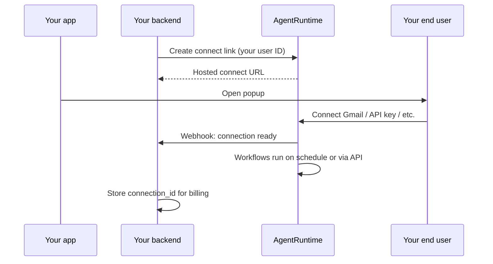

# Embed AgentRuntime in your product

Connect your customers' apps (Gmail, Slack, API keys, and more), run scheduled workflows, and store results — **inside your product**, without your customers signing up for AgentRuntime.

This guide is for **platform and SaaS teams** building B2B2C integrations: you are the AgentRuntime **workspace**; your users are **end users** who connect accounts and consume automation you provide.

---

## At a glance

| | |
|--|--|
| **You (partner)** | One AgentRuntime workspace; you pay AgentRuntime for usage |
| **Your customer** | Identified by **your** stable user ID (`external_user_id`) |
| **Your customer's end user** | Connects Gmail (or other apps) in **your** UI via a hosted popup |
| **AgentRuntime handles** | OAuth, API keys, token refresh, Vault storage, workflows, scheduling, metering |
| **You handle** | One server API call, open popup, receive webhook, bill your users |

Your end users **do not** need AgentRuntime accounts unless you later invite them to the Console.

---

## How it works



**In plain terms:**

1. Your backend tells AgentRuntime: *"User `cust_9182` wants to connect."*
2. Your frontend opens our hosted connect page in a popup.
3. The end user completes OAuth (or enters an API key on our form).
4. We send **your server** a webhook with a `connection_id`.
5. Your scheduled workflows sync data; we record usage **per your user ID** so you can bill them.

---

## Two setup choices (independent)

### 1. Integration style (how much code you write)

We recommend **standard integration** for most partners:

| | Standard (recommended) | Enterprise (optional) |
|--|------------------------|------------------------|
| **Your backend** | One API token (PAT) on the server | Signed JWT + your public keys |
| **Your frontend** | Open a popup URL | Same popup |
| **Complexity** | Afternoon to integrate | For large ISV security reviews |

You do **not** need to implement OAuth, token refresh, or Vault.

### 2. Google consent branding (whose name appears on Google)

If you use Gmail or Google Workspace:

| | AgentRuntime OAuth (pilot) | **Your Google app (recommended for production)** |
|--|----------------------------|--------------------------------------------------|
| **Consent screen** | "AgentRuntime wants access…" | **"Your Company" wants access…** |
| **One-time setup** | None | Paste Google Client ID + Secret in Console (**Settings → MCP → Google OAuth**) |
| **Best for** | Dev / pilot | Production embed |

This is **not** extra engineering — you register one OAuth app in Google Cloud Console once, then paste credentials in AgentRuntime. We still host the connect flow and store tokens.

Other connectors (Notion, Slack, API keys, WhatsApp, etc.) follow the same connect popup; Google is the most common white-label case.

---

## One-time setup in AgentRuntime Console

Complete these steps once per workspace:

### 1. Workspace and billing

- Create your AgentRuntime workspace at [console.agentruntime.io](https://console.agentruntime.io).
- Ensure billing/credits are active for workflow runs.

### 2. Google white-label (recommended for Gmail)

If end users connect Gmail and should see **your** brand on Google's consent screen:

1. Create an OAuth 2.0 Web client in [Google Cloud Console](https://console.cloud.google.com/).
2. In AgentRuntime: **Settings → MCP → Google OAuth application**.
3. Enter your **Client ID** and **Client Secret**.
4. Use the redirect URI shown in Console when configuring Google.

See also: [Google Workspace integrations](/integrations/google-workspace).

### 3. Server API token (PAT)

1. In Console, create a **Personal access token** with automation scopes.
2. Store it **only on your server** (environment variable) — never in a browser or mobile app.

See: [API authentication](/api/authentication).

### 4. Webhook URL

1. Register your webhook URL in Console (or workspace settings when available).
2. Verify the HMAC signature on incoming events (same pattern as [inbound webhooks](/integrations/inbound-webhooks)).

You will receive events such as `connection.created` with your user ID and our `connection_id`.

### 5. Workflows

- Deploy your workflow template (for example: scheduled Gmail sync → your database).
- Configure a **cron trigger** or start runs via API when a connection is ready.

See: [Workflows](/workflows/studio), [External triggers](/workflows/external-triggers).

---

## What your backend implements

### Step 1 — Create a connect link

Call AgentRuntime from **your server** when an end user clicks "Connect Gmail" (or similar):

```http
POST https://api.agentruntime.io/v1/connect/link
Authorization: Bearer pat_xxxxxxxx
Content-Type: application/json

{
  "external_user_id": "cust_9182",
  "provider": "gmail",
  "services": ["gmail"]
}
```

Use **your database primary key** (or stable customer ID) as `external_user_id`. It must be **unique per customer in your product** and must not change over time.

**Response:**

```json
{
  "connect_url": "https://connect.agentruntime.io/s/cs_abc123",
  "connect_session_id": "cs_abc123",
  "expires_at": "2026-08-13T10:05:00Z"
}
```

The connect link expires in a few minutes and is single-use.

### Step 2 — Receive the webhook

When the end user finishes connecting, AgentRuntime POSTs to your webhook:

```json
{
  "event": "connection.created",
  "external_user_id": "cust_9182",
  "connection_id": "conn_xxxxxxxx",
  "provider": "google_account",
  "provider_account_key": "alice@gmail.com",
  "occurred_at": "2026-08-13T10:04:00Z"
}
```

Store `connection_id` keyed by your `external_user_id`. You need both IDs for support and billing.

Verify the `X-Agentruntime-Signature` header before trusting the payload.

### Step 3 — Run workflows (optional)

Start a workflow for that user after connect, or rely on cron:

```http
POST https://api.agentruntime.io/v1/workflows/{workflow_id}/command
Authorization: Bearer pat_xxxxxxxx
Content-Type: application/json

{
  "command": "execute",
  "params": {
    "external_user_id": "cust_9182"
  }
}
```

---

## What your frontend implements

Minimal pattern — open a popup:

```javascript
async function connectIntegration() {
  const res = await fetch("/api/your-backend/connect-link", { method: "POST" });
  const { connect_url } = await res.json();
  window.open(
    connect_url,
    "agentruntime-connect",
    "width=520,height=720,noopener"
  );
}
```

Your backend creates the link; the frontend only opens the URL. **Never** put your AgentRuntime PAT in frontend code.

Optional: listen for a `postMessage` from the connect page when the popup closes successfully.

---

## Supported connection types

AgentRuntime uses the same connect infrastructure as the Console. End users may connect via:

| Type | Examples | What the end user sees |
|------|----------|-------------------------|
| **OAuth** | Gmail, Google Drive, Notion, GitHub | Provider consent screen (your brand if you BYO OAuth) |
| **API key** | Resend, many catalog connectors | Secure form on our hosted page; keys go to Vault |
| **Embedded signup** | WhatsApp | Meta business signup flow |

You call the **same** connect-link API; we route to the correct flow for each provider.

---

## Identity and privacy

### Your user ID

- Pass your own stable ID as `external_user_id`.
- It only needs to be unique **within your workspace**, not globally across all AgentRuntime customers.
- Two different companies can both use `"user_42"` — they are isolated by workspace.

### Same person, two of your competitors' platforms

If Alice uses **Company A's product** and **Company B's product**, both powered by AgentRuntime:

- She has **separate connections and data** in each workspace.
- Data is **not shared** between Company A and Company B.
- If Alice later creates one AgentRuntime login, she can optionally link both — without merging business data.

### Same Gmail twice in **your** product

One Google account can only be linked to **one** of your end users at a time within your workspace. A second connect attempt for the same Gmail under a different user ID is rejected to prevent accidental data sharing.

---

## Billing

| Who pays whom | |
|---------------|--|
| **You → AgentRuntime** | Workflow runs and platform usage (your workspace credit pool) |
| **Your customer → You** | Your product pricing (AgentRuntime does not bill your end users) |

AgentRuntime records usage tagged with your `external_user_id` so you can export reports and pass costs through to your customers.

---

## What you store vs what we store

| You store | AgentRuntime stores |
|-----------|---------------------|
| `external_user_id` (your customer ID) | OAuth refresh tokens, API keys (Vault) |
| `connection_id` (from webhook) | Workflow definitions, run history, synced data (tenant data) |
| Your PAT (server env only) | Usage metering per end user |

You **never** receive or manage OAuth refresh tokens. That is intentional — we handle refresh, rotation, and secure storage.

---

## FAQ

### Do my end users need AgentRuntime accounts?

**No** for embedded connect. They only see your UI and our hosted connect popup.

You may optionally invite someone to the Console later (for example your internal admins or a power user who wants to inspect runs).

### Do I have to build OAuth?

**No.** For standard integration, you make one server-side API call and open a popup. For Google production branding, you paste OAuth credentials in Console once (Model B) — you still do not write OAuth code.

### Can I use this for API-key connectors (not just Google)?

**Yes.** The same connect-link flow hosts API key forms where applicable. Keys are submitted directly to AgentRuntime Vault, not to your backend.

### What if I only have a simple backend (Node, Python, PHP)?

That is the expected case. PAT on the server, one route to create a link, one webhook route to receive `connection.created`. No JWT or crypto required for standard integration.

### How is this different from Zapier or Composio?

Similar **identity model** (your user ID, our hosted connect, we hold tokens). AgentRuntime adds **workflows, scheduling, tenant data, and agents** under your workspace — not just tool calls.

### Is the Connect Link API available today?

**Embedded Connect** (connect link, webhooks, per–end-user isolation without Console signup) is rolling out in phases.

| Status | What you can do |
|--------|-----------------|
| **Available now** | BYO Google OAuth in Console, workflows, cron, tenant data, PAT API, Console connections |
| **Pilot (invite-based)** | Invite end users as workspace members; they connect on `/connections`; workflows run on schedule |
| **Coming (Embedded Connect API)** | Connect link + popup + webhook without end-user AgentRuntime login |

Contact [support@agentruntime.io](mailto:support@agentruntime.io) for early access to Embedded Connect or pilot onboarding.

## Reference demo

A runnable **FastAPI + React** partner app lives in the monorepo:

`dev_tools/embedded-connect-demo/`

It implements Tier A (PAT + popup + webhook) against a real localprod BFF and is suitable to share with customers evaluating the integration.

---

## Checklist before go-live

- [ ] Workspace created; billing active
- [ ] Google OAuth app configured in Console (if using Gmail with your brand)
- [ ] PAT created and stored server-side only
- [ ] Webhook URL registered and signature verification tested
- [ ] Workflow + schedule deployed
- [ ] `external_user_id` documented for your team (stable per customer)
- [ ] Popup connect flow tested end-to-end
- [ ] Usage export plan for billing your customers

---

## Related documentation

- [Integrations quickstart](/integrations/quickstart) — connections, MCP instances, workflows
- [Connections](/integrations/connections) — Console connection management
- [Google Workspace](/integrations/google-workspace) — OAuth and services
- [API authentication](/api/authentication) — PATs for automation
- [Inbound webhooks](/integrations/inbound-webhooks) — webhook signature verification
- [Billing and credits](/platform/billing-and-credits) — workspace usage

---

## Support

Questions about embedded integrations or early access:

- Email: [support@agentruntime.io](mailto:support@agentruntime.io)
- Console: [console.agentruntime.io](https://console.agentruntime.io)

When contacting support, include your workspace name and whether you need Gmail white-label (BYO Google OAuth) or other connectors.
