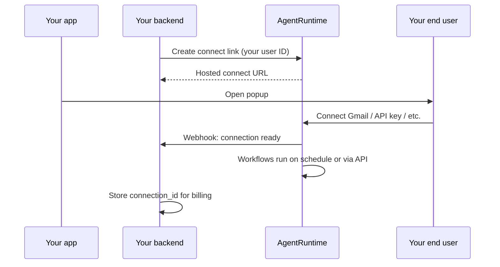

# Embed AgentRuntime in your product

Connect your customers' apps (Gmail, Slack, API keys, and more), run scheduled workflows, and store results — **inside your product**, without your customers signing up for AgentRuntime.

This guide is for **platform and SaaS teams** building B2B2C integrations: you are the AgentRuntime **workspace**; your users are **end users** who connect accounts and consume automation you provide.

---

## At a glance

| | |
|--|--|
| **You (partner)** | One AgentRuntime workspace; you pay AgentRuntime for usage |
| **Your customer** | Identified by **your** stable user ID (`external_user_id`) |
| **Your customer's end user** | Connects Gmail (or other apps) in **your** UI via a hosted popup |
| **AgentRuntime handles** | OAuth, API keys, token refresh, Vault storage, workflows, scheduling, metering |
| **You handle** | One server API call, open popup, receive webhook, bill your users |

Your end users **do not** need AgentRuntime accounts unless you later invite them to the Console.

---

## How it works



**In plain terms:**

1. Your backend tells AgentRuntime: *"User `cust_9182` wants to connect."*
2. Your frontend opens our hosted connect page in a popup (AgentRuntime shows a **Google × AgentRuntime** intro screen first; the user clicks **Continue to Google** before OAuth).
3. The end user completes OAuth (or enters an API key on our form).
4. We send **your server** a webhook when the connection is ready (optional: cache `connection_id` for support).
5. When you want to sync or automate, call **execute with the same `external_user_id`** — we resolve their Gmail. Your cron can loop customer IDs; we meter usage per user so you can bill them.

---

## Two setup choices (independent)

### 1. Integration style (how much code you write)

We recommend **standard integration** for most partners:

| | Standard (recommended) | Enterprise (optional) |
|--|------------------------|------------------------|
| **Your backend** | One API token (PAT) on the server | Signed JWT + your public keys |
| **Your frontend** | Open a popup URL | Same popup |
| **Complexity** | Afternoon to integrate | For large ISV security reviews |

You do **not** need to implement OAuth, token refresh, or Vault.

### 2. Google consent branding (whose name appears on Google)

If you use Gmail or Google Workspace:

| | AgentRuntime OAuth (pilot) | **Your Google app (recommended for production)** |
|--|----------------------------|--------------------------------------------------|
| **Consent screen** | "AgentRuntime wants access…" | **"Your Company" wants access…** |
| **One-time setup** | None | Paste Google Client ID + Secret in Console (**Settings → MCP → Google OAuth**) |
| **Best for** | Dev / pilot | Production embed |

This is **not** extra engineering — you register one OAuth app in Google Cloud Console once, then paste credentials in AgentRuntime. We still host the connect flow and store tokens.

Other connectors (Notion, Slack, API keys, WhatsApp, etc.) follow the same connect popup; Google is the most common white-label case.

---

## One-time setup in AgentRuntime Console

Complete these steps once per workspace:

### 1. Workspace and billing

- Create your AgentRuntime workspace at [console.agentruntime.io](https://console.agentruntime.io).
- Ensure billing/credits are active for workflow runs.

### 2. Google white-label (recommended for Gmail)

If end users connect Gmail and should see **your** brand on Google's consent screen:

1. Create an OAuth 2.0 Web client in [Google Cloud Console](https://console.cloud.google.com/).
2. In AgentRuntime: **Settings → MCP → Google OAuth application**.
3. Enter your **Client ID** and **Client Secret**.
4. Use the redirect URI shown in Console when configuring Google.

See also: [Google Workspace integrations](/integrations/google-workspace).

### 3. Server API token (PAT)

1. In Console, create a **Personal access token** with automation scopes.
2. Store it **only on your server** (environment variable) — never in a browser or mobile app.

See: [API authentication](/api/authentication).

### 4. Webhook URL

1. Register your webhook URL in Console (or workspace settings when available).
2. Verify the HMAC signature on incoming events (same pattern as [inbound webhooks](/integrations/inbound-webhooks)).

You will receive events such as `connection.created` with your user ID and our `connection_id`.

### 5. Workflows

- Deploy your workflow template (for example: scheduled Gmail sync → your database).
- Start runs via API with **`external_user_id`** when a user connects or on your schedule.
- **Your cron** loops customer IDs and calls execute — we resolve each user's connection (no per-step wiring in the graph).

See: [Workflows](/workflows/studio), [External triggers](/workflows/external-triggers).

---

## What your backend implements

### Step 1 — Create a connect link

Call AgentRuntime from **your server** when an end user clicks "Connect Gmail" (or similar):

```http
POST https://api.agentruntime.io/v1/connect/link
Authorization: Bearer pat_xxxxxxxx
Content-Type: application/json

{
  "external_user_id": "cust_9182",
  "provider": "gmail",
  "services": ["gmail"]
}
```

Use **your database primary key** (or stable customer ID) as `external_user_id`. It must be **unique per customer in your product** and must not change over time.

**Response:**

```json
{
  "connect_url": "https://connect.agentruntime.io/s/cs_abc123",
  "connect_session_id": "cs_abc123",
  "expires_at": "2026-08-13T10:05:00Z"
}
```

The connect link expires in a few minutes and is single-use.

### Step 2 — Receive the webhook

When the end user finishes connecting, AgentRuntime POSTs to your webhook:

```json
{
  "event": "connection.created",
  "external_user_id": "cust_9182",
  "connection_id": "conn_xxxxxxxx",
  "provider": "google_account",
  "provider_account_key": "alice@gmail.com",
  "occurred_at": "2026-08-13T10:04:00Z"
}
```

Store `connection_id` keyed by your `external_user_id` if useful for support — **optional**. Running workflows only requires `external_user_id` at execute time.

Verify the `X-Agentruntime-Signature` header before trusting the payload.

### Step 3 — Run workflows

Start a workflow for that user with **the same ID you used at connect**:

```http
POST https://api.agentruntime.io/v1/workflows/{workflow_id}/command
Authorization: Bearer pat_xxxxxxxx
Content-Type: application/json

{
  "command": "execute",
  "params": {
    "external_user_id": "cust_9182"
  }
}
```

AgentRuntime resolves the principal and Gmail connection — you do not pass OAuth tokens or per-step connection overrides.

Each MCP step in the workflow graph may declare **`connection_resolution`**:

| Value | When execute includes `external_user_id` |
|-------|------------------------------------------|
| `principal` | Use the end user's OAuth connection (e.g. their Gmail inbox) |
| `workspace` | Use the tenant template connection (e.g. shared tenant-data) |
| `inherit` / omitted | **Workspace by default.** Principal only if the step's template connection is principal-scoped (`connection_scope=principal`). |

For embedded Gmail sync, set Gmail MCP steps to **`principal`** explicitly. Automatic will not assume Gmail is per-end-user.

Workflow Studio shows this on MCP steps and in the workflow **API** tab under **Embedded Connect**. If a principal-scoped step runs before the user has connected, execute returns `principal_not_connected` with `details.step_name` and `details.provider`.

**Scheduled sync (typical):** your backend cron or job queue loops customers and calls the same execute API:

```python
for user in customers.where(sync_enabled=True):
    execute_workflow(WF_ID, external_user_id=user.id)
```

Optional: call `GET /v1/principals?provider=gmail` to list only users who finished connect. In Console, open **Integrations → Principals** for the same view with connection badges.

---

## Two ways to run for many users (same Gmail resolution)

Both paths end with **one execute per `external_user_id`** — we resolve Gmail each time.

### Minimal (default)

Your cron loops customer IDs from **your database**:

```python
for user in customers.where(sync_enabled=True):
    execute_workflow(WF_ID, external_user_id=user.id)
```

Best for: small backends, full control, no extra AgentRuntime APIs.

### Richer (optional — P2.5 / P3)

**Sync** customer metadata to AgentRuntime, then **pick a group** when scheduling:

```http
POST /v1/principals/sync
Authorization: Bearer pat_xxxxxxxx

{
  "principals": [
    {
      "external_user_id": "cust_9182",
      "email": "alice@example.com",
      "name": "Alice",
      "team": "sales",
      "tags": ["paid", "eu"]
    }
  ]
}
```

Create a **segment** (filter) via **API**, then attach it to a workflow cron schedule in **Workflow Studio → Schedule** (or **Operate → Schedules**). Each fire expands the segment and starts one run per matched end user.

```json
{
  "name": "paid-eu-gmail",
  "filter": {
    "include_tags": ["paid"],
    "exclude_tags": ["churned"],
    "team": "eu",
    "require_connection": "google_account"
  }
}
```

Run the workflow for everyone in that segment:

```http
POST /v1/workflows/{workflow_id}/command

{
  "command": "execute",
  "params": { "segment_id": "seg_abc123" }
}
```

Best for: Console scheduling with include/exclude, one place to see who connected Gmail, no cron loop in your backend.

| | Minimal | Richer |
|--|---------|--------|
| Sync metadata to us | Optional | Recommended |
| Who builds the run list | Your cron | Segment filter (or Console) |
| Connect + execute | Same | Same |

New principals that match a segment are included on the next run automatically. Suspended or deleted users are excluded.

---

## Which path should I use?

**Default: start minimal.** Most partners only need connect, webhook, and a cron that loops customer IDs.

```text
Do your end users need AgentRuntime login?
  No → Embedded Connect (this guide)

Who builds the list of users to run?
  Our backend cron + our customer IDs  → Minimal (recommended)
  Console filters (team, tags, connected) → Richer (P2.5 / P3 — optional)

Gmail shows our company on Google's screen?
  Yes → One-time BYO Google OAuth in Console (not extra code)
```

| Question | Minimal (default) | Richer (optional) |
|----------|-------------------|-------------------|
| APIs beyond connect + execute | None | `principals/sync`, segments |
| When to choose | You have customer IDs and a scheduler | You want Console scheduling or tag filters |
| Can I add richer later? | **Yes** — same connect + execute underneath |

---

## Operational notes

### Sync vs connect — what to trust

| Data | Source of truth |
|------|-----------------|
| Gmail connected? OAuth tokens? | **AgentRuntime** (connect + webhook) |
| Email, team, tags for filtering | **Your CRM** (optional sync via `POST /v1/principals/sync`) |

You do not need sync to connect users. Sync does not grant credentials — it only copies metadata for Console and segments. If your local "connected" flag disagrees with our webhook, **trust the webhook**.

### Users who have not connected yet

- **Execute**: returns `principal_not_connected` — no run, no usage charge.
- **Segments**: skipped in batch results, not treated as a hard failure.
- **Your UI**: show "Connect Gmail" until you receive `connection.created`.

Sync-before-connect is supported: we can hold a principal row with metadata before OAuth, but automation waits until connect completes.

### Console cron vs your cron

| | Console workflow cron (no segment) | Segment cron or your backend cron |
|--|-----------------------------------|-----------------------------------|
| **Runs as** | Your workspace automation identity (API key owner) | Each **end user** (`external_user_id`) when using a **segment** or your execute loop |
| **Gmail** | One shared workspace connection | Each customer's own account (embedded) |
| **Use for** | Internal ops, demos, tenant-wide jobs | B2B2C product automation |

**Embedded per-customer Gmail:** use **your cron** that loops `external_user_id`, **`execute { segment_id }`**, or a **Console cron schedule with a principal segment** attached (Workflow Studio → Schedule, or Operate → Schedules). A plain Console cron without `segment_id` does **not** fan out to end users.

### Recommended rollout order

1. **P1** — Connect link + hosted popup + webhook
2. **P2** — Execute with `external_user_id` (no connection wiring in the graph)
3. **Minimal at scale** — Your cron loops customer IDs, or export usage with `GET /v1/usage-history?group_by=principal`
4. **Richer (optional)** — Sync metadata, segments, Console Principals list, segment-based schedules

---

## Partner API reference

All routes use your server-side **PAT** (`Authorization: Bearer pat_…`). Base URL: your workspace API host (e.g. `https://api.agentruntime.io`).

### Connect

| Method | Path | Purpose |
|--------|------|---------|
| `POST` | `/v1/connect/link` | Create hosted connect session |
| `GET` | `/v1/connect/sessions/{id}` | Poll session status |
| `PUT` | `/v1/embedded-connect/settings` | Webhook URL + secret for `connection.created` |

### Execute

| Method | Path | Purpose |
|--------|------|---------|
| `POST` | `/v1/workflows/{workflow_id}/command` | Start run; `command: execute` with `params.external_user_id` or `params.segment_id` |

### Principals (P2 / P2.5)

| Method | Path | Purpose |
|--------|------|---------|
| `GET` | `/v1/principals` | List/filter (`external_user_id`, `team`, `tag`, `provider`, `has_connection`, `status`) |
| `GET` | `/v1/principals/{external_id}` | One principal + connections |
| `PUT` | `/v1/principals/{external_id}` | Upsert metadata for one principal |
| `POST` | `/v1/principals/sync` | Batch metadata upsert |
| `POST` | `/v1/principals/{external_id}/suspend` | Exclude from future runs |
| `DELETE` | `/v1/principals/{external_id}` | Soft delete; revokes connections and purges Vault secrets |
| `POST` | `/v1/principals/{external_id}/link` | Link principal to Console user (`{ "user_id": "…" }`) — admin |
| `DELETE` | `/v1/principals/{external_id}/link` | Remove Console user link |

**List query example:**

```http
GET /v1/principals?provider=google_account&has_connection=true&status=active
```

### Segments (P3)

| Method | Path | Purpose |
|--------|------|---------|
| `GET` | `/v1/principal-segments` | List segments |
| `POST` | `/v1/principal-segments` | Create segment `{ "name", "filter" }` |
| `GET` | `/v1/principal-segments/{id}` | Get segment definition |

**Create segment:**

```http
POST /v1/principal-segments
Content-Type: application/json

{
  "name": "paid-eu-gmail",
  "filter": {
    "include_tags": ["paid"],
    "exclude_tags": ["churned"],
    "team": "eu",
    "require_connection": "google_account"
  }
}
```

**Batch execute by segment** returns `matched`, `started`, `skipped`, `failed`, and per-principal `results`. Empty segments return HTTP 200 with `error: segment_empty` (not 404).

### Usage export (P2)

```http
GET /v1/usage-history?group_by=principal&from=2026-08-01T00:00:00Z&to=2026-08-31T23:59:59Z
```

Aggregates workflow usage by `principal_id` / `external_user_id` from run metadata for pass-through billing.

---

## Console features (embedded partners)

| Console surface | Path | Purpose |
|-----------------|------|---------|
| **Principals** | Integrations → **Principals** (`/principals`) | Who connected; metadata tags; suspend/delete; optional link to workspace member |
| **Segment schedule** | Workflow Studio → **Schedule** | Pick an existing **Principal segment** on cron — expands to one run per matched end user each fire (create segments via API) |
| **Operate schedules** | Operate → **Schedules** | Same segment picker when creating tenant cron schedules |
| **Google OAuth** | Settings → MCP → Google OAuth | BYO consent branding (recommended for production Gmail) |
| **Embedded connect settings** | Settings (webhook URL) | Partner `connection.created` delivery |

---

## What your frontend implements

Minimal pattern — open a popup:

```javascript
async function connectIntegration() {
  const res = await fetch("/api/your-backend/connect-link", { method: "POST" });
  const { connect_url } = await res.json();
  window.open(
    connect_url,
    "agentruntime-connect",
    "width=520,height=720,noopener"
  );
}
```

Your backend creates the link; the frontend only opens the URL. **Never** put your AgentRuntime PAT in frontend code.

Optional: listen for a `postMessage` from the connect page when the popup closes successfully.

---

## Supported connection types

AgentRuntime uses the same connect infrastructure as the Console. End users may connect via:

| Type | Examples | What the end user sees |
|------|----------|-------------------------|
| **OAuth** | Gmail, Google Drive, Notion, GitHub | Provider consent screen (your brand if you BYO OAuth) |
| **API key** | Resend, many catalog connectors | Secure form on our hosted page; keys go to Vault |
| **Embedded signup** | WhatsApp | Meta business signup flow |

You call the **same** connect-link API; we route to the correct flow for each provider.

---

## Identity and privacy

### Your user ID

- Pass your own stable ID as `external_user_id`.
- It only needs to be unique **within your workspace**, not globally across all AgentRuntime customers.
- Two different companies can both use `"user_42"` — they are isolated by workspace.

### Same person, two of your competitors' platforms

If Alice uses **Company A's product** and **Company B's product**, both powered by AgentRuntime:

- She has **separate connections and data** in each workspace.
- Data is **not shared** between Company A and Company B.
- If Alice later creates one AgentRuntime login, she can optionally link both — without merging business data.

### Same Gmail twice in **your** product

One Google account can only be linked to **one** of your end users at a time within your workspace. A second connect attempt for the same Gmail under a different user ID is rejected to prevent accidental data sharing.

---

## Billing

| Who pays whom | |
|---------------|--|
| **You → AgentRuntime** | Workflow runs and platform usage (your workspace credit pool) |
| **Your customer → You** | Your product pricing (AgentRuntime does not bill your end users) |

AgentRuntime records usage tagged with your `external_user_id` (and `principal_id` on each run) so you can export reports and pass costs through to your customers.

**Export by end user:**

```http
GET /v1/usage-history?group_by=principal&from=2026-08-01T00:00:00Z&to=2026-08-31T23:59:59Z
```

Response items include `external_user_id`, `run_count`, and `total_delta_microcredits` per principal.

---

## What you store vs what we store

| You store | AgentRuntime stores |
|-----------|---------------------|
| `external_user_id` (your customer ID — **required**, stable) | OAuth refresh tokens, API keys (Vault) |
| Optional: `connection_id` from webhook (support/UI) | Principal row, connection binding, workflow definitions, run history |
| Your PAT (server env only) | Usage metering per end user |

You **never** receive or manage OAuth refresh tokens. You **do not** need to wire connections into the workflow graph per customer — pass `external_user_id` at execute time.

---

## FAQ

### Do my end users need AgentRuntime accounts?

**No** for embedded connect. They only see your UI and our hosted connect popup.

You may optionally invite someone to the Console later (for example your internal admins or a power user who wants to inspect runs).

### Do I have to build OAuth?

**No.** For standard integration, you make one server-side API call and open a popup. For Google production branding, you paste OAuth credentials in Console once (Model B) — you still do not write OAuth code.

### Can I use this for API-key connectors (not just Google)?

**Yes.** The same connect-link flow hosts API key forms where applicable. Keys are submitted directly to AgentRuntime Vault, not to your backend.

### What if I only have a simple backend (Node, Python, PHP)?

That is the expected case. PAT on the server, one route to create a link, one webhook route, one execute call per user with `external_user_id`. No JWT, no OAuth code, no connection overrides per workflow step.

### How do scheduled / batch runs work?

**Your scheduler** loops customer IDs and calls execute with each `external_user_id`. AgentRuntime resolves credentials per run. You can also list connected users via `GET /v1/principals` instead of maintaining connect state twice.

Export per-user usage for pass-through billing:

```http
GET /v1/usage-history?group_by=principal&from=2026-08-01T00:00:00Z&to=2026-08-31T23:59:59Z
```

### How is this different from Zapier or Composio?

Similar **identity model** (your user ID, our hosted connect, we hold tokens). AgentRuntime adds **workflows, scheduling, tenant data, and agents** under your workspace — not just tool calls.

### Is Embedded Connect available?

Embedded Connect is **generally available** in phases. Most partners ship **P1 + P2** first (connect + execute-by-user-ID).

| Phase | Capabilities |
|-------|----------------|
| **P1** | `POST /v1/connect/link`, hosted connect page (`/connect/s/{id}` interstitial + OAuth), `connection.created` webhook |
| **P2** | Execute with `external_user_id` / `principal_id`; usage export `group_by=principal`; suspend/delete principal |
| **P2.5** | `POST /v1/principals/sync`, `GET /v1/principals`, Console **Principals** list, admin user link |
| **P3** | `POST /v1/principal-segments`, execute or cron with `segment_id`, segment picker on workflow schedules |
| **Console (always)** | BYO Google OAuth, workflows, tenant cron, tenant data, PAT API |
| **Legacy pilot** | Invite end users as workspace members; they connect on `/connections` (not recommended for B2B2C) |

Apply database migrations `000034`–`000036` on control-service before using principals, segments, and principal-scoped runs in self-hosted environments.

Contact [support@agentruntime.io](mailto:support@agentruntime.io) for pilot onboarding or integration review.

## Reference demo

A runnable **FastAPI + React** partner app lives in the monorepo:

`dev_tools/embedded-connect-demo/`

It implements Tier A (PAT + popup + webhook) against a real localprod BFF and is suitable to share with customers evaluating the integration.

---

## Checklist before go-live

- [ ] Workspace created; billing active
- [ ] Google OAuth app configured in Console (if using Gmail with your brand)
- [ ] PAT created and stored server-side only
- [ ] Webhook URL registered and signature verification tested
- [ ] Workflow template deployed
- [ ] **Start minimal:** partner cron + execute (add sync/segments when Console filtering helps)
- [ ] Scheduled runs: your cron, `segment_id` execute, or Console cron **with segment** (optional)
- [ ] `external_user_id` documented for your team (stable per customer)
- [ ] Popup connect flow tested end-to-end
- [ ] Console **Principals** reviewed for support / "who connected" visibility (optional)
- [ ] Usage export tested (`group_by=principal`) if billing pass-through to customers

---

## Related documentation

- [Integrations quickstart](/integrations/quickstart) — connections, MCP instances, workflows
- [Connections](/integrations/connections) — Console connection management
- [Google Workspace](/integrations/google-workspace) — OAuth and services
- [API authentication](/api/authentication) — PATs for automation
- [Inbound webhooks](/integrations/inbound-webhooks) — webhook signature verification
- [Billing and credits](/platform/billing-and-credits) — workspace usage

---

## Support

Questions about embedded integrations or early access:

- Email: [support@agentruntime.io](mailto:support@agentruntime.io)
- Console: [console.agentruntime.io](https://console.agentruntime.io)

When contacting support, include your workspace name and whether you need Gmail white-label (BYO Google OAuth) or other connectors.
