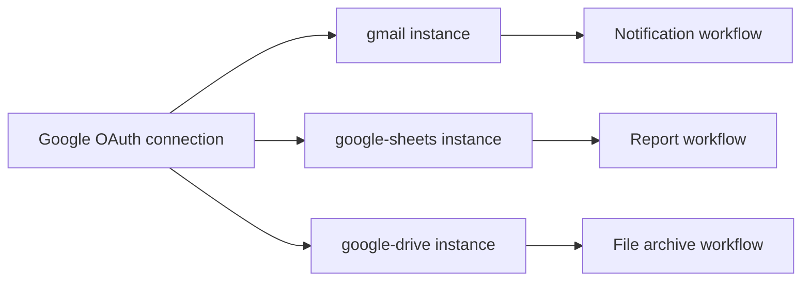

AgentRuntime connects to Google Workspace through a single **Google connection** (OAuth 2.0). One authorized account can power multiple MCP adapters — you do not repeat OAuth for each service.

## Supported adapters

Enable the services you need on your Google connection, then install the matching MCP instances:

| Adapter | Use for |
|---------|---------|
| `gmail` | Send, search, and reply to email |
| `google-drive` | Files and folders |
| `google-sheets` | Spreadsheets read/write |
| `google-calendar` | Events and calendars |
| `google-docs` | Documents |
| `google-slides` | Presentations |
| `google-tasks` | Task lists |
| `google-form` | Form responses |
| `google-search` | Programmable search |
| `google-search-console` | Search analytics |

Each adapter is a separate MCP instance bound to the same Google connection.

## Setup

<Steps>
  <Step title="Connect your Google account">
    Go to **Connections → Google** and click **Connect account**. Sign in and grant the requested OAuth scopes.
  </Step>
  <Step title="Enable services">
    Select which Workspace services this account exposes — Gmail, Drive, Sheets, Calendar, and others. You can add services later without re-creating the connection.
  </Step>
  <Step title="Install MCP instances">
    For each service you need, go to **MCP → Catalog**, install the adapter (for example, `google-sheets`), and bind your Google connection.
  </Step>
  <Step title="Validate each instance">
    Run **Validate bindings** on every installed instance before adding it to production workflows.
  </Step>
</Steps>

<Note>
  [Gmail](/connectors/gmail) has a dedicated setup guide with tool details and search syntax. The steps above apply to all Google Workspace adapters.
</Note>

## One connection, many workflows

Workflow **mcp_call** steps target the specific instance for each tool — not the connection directly.

## Common patterns

### Read a Sheet, process rows, send email

1. `google-sheets` — read range
2. `lua_script` or `for_each` — transform rows
3. `gmail` — `send_email` with summary

### Create a Calendar event after approval

1. `human_task` — approve meeting details
2. `google-calendar` — create event with approved payload

### Archive Drive files on schedule

1. Inbound webhook or manual trigger with folder ID
2. `google-drive` — list and copy/move files
3. `gmail` — send completion summary

See [Workflow patterns](/workflows/patterns) for approve-then-send and webhook triggers.

## Token refresh and reconnect

Google OAuth tokens refresh automatically. If a user revokes access or changes their Google password, the connection shows **Reconnect**.

<Steps>
  <Step title="Reconnect">
    Open **Connections → Google**, click **Reconnect**, and re-authorize.
  </Step>
  <Step title="Re-validate instances">
    Run **Validate bindings** on all Google MCP instances bound to that connection.
  </Step>
  <Step title="Re-run failed workflows">
    Runs that failed with `MCP_TOOL_FAILED` during the outage need a new run after reconnect.
  </Step>
</Steps>

## Scopes

Each adapter requests the minimum Google API scopes it needs. Enabling a service on the connection grants the scopes for that adapter. If you add a new service later, the Console may prompt for additional consent.

## Per-environment overrides

Use workflow **connection overrides** to point the same graph at different Google accounts — for example, a sandbox account in development and a production account in prod.

## Troubleshooting

| Issue | Fix |
|-------|-----|
| **Reconnect** banner | Re-authorize OAuth; check Google Admin policy allows the app |
| `403` insufficient scopes | Enable the service on the connection; reconnect to grant new scopes |
| `404` not found | Verify file ID, calendar ID, or spreadsheet ID in `tool_args` |
| Works in dev, fails in prod | Check connection override points to the correct account |

See [Troubleshooting](/platform/troubleshooting) for binding and auth errors.

## Related docs

- [Gmail connector](/connectors/gmail) — email tools and search syntax
- [Connections](/integrations/connections) — credential management
- [Connector catalog](/integrations/connector-catalog) — full adapter list
