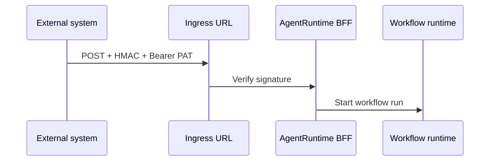

**Inbound webhooks** let external systems start workflow runs by POSTing to a signed URL. Each subscription is linked to one workflow in your project.

<Note>
  **Generally available** when `inbound_webhooks` is enabled on your BFF (default **on** in standard deployments). If **Inbound** tabs or Settings lists are missing, your operator may have disabled ingress — contact [support@agentruntime.io](mailto:support@agentruntime.io).
</Note>

## How it works



1. You create a **subscription** linked to a workflow
2. AgentRuntime returns an **ingress URL** and **signing secret** (shown once at creation)
3. Senders POST JSON to the ingress URL with HMAC signature and a **Bearer PAT** for automation auth
4. The BFF verifies the signature and starts a run with the POST body as workflow input (`webhook_payload` in start params)

Saved **Run setup** defaults from Workflow Studio are **not** applied unless the subscription `extras` sets `use_run_setup_defaults: true`. See [Run setup](/workflows/run-setup).

## Create a subscription in the Console

<Steps>
  <Step title="Open Workflow Studio">
    Open the target workflow at `/workflow/{workflow_id}`.
  </Step>
  <Step title="Workflow config → Inbound tab">
    In the workflow configuration panel, open the **Inbound** tab. (Same subscriptions also appear under **Settings → Inbound webhooks** for workspace-wide management.)
  </Step>
  <Step title="Name and automation PAT">
    Enter a subscription label. Select an existing **API key** (PAT) for automation, or paste a `pat_…` token once if Vault does not hold the secret.
  </Step>
  <Step title="Create and copy secrets">
    Click create. Copy the **signing secret** and **ingress URL** immediately — the secret is not shown again.
  </Step>
  <Step title="Test">
    Use the generated curl template (includes `X-Agentruntime-Signature` and `Authorization: Bearer pat_…`) or POST from your external system.
  </Step>
</Steps>

<Warning>
  Never expose signing secrets or automation PATs in client-side code or public repositories. Rotate immediately if compromised.
</Warning>

## Create via API

Requires **project_contributor**:

```
POST /v1/inbound-webhooks
```

Request body:

```json
{
  "workflow_id": "your-workflow-uuid",
  "name": "shopify-orders",
  "automation_pat_id": "optional-wheelhouse-pat-id",
  "automation_bearer": "pat_…"
}
```

Response includes `ingress_url`, `ingress_path`, `signing_secret`, and `subscription`. List and delete:

```
GET /v1/inbound-webhooks
DELETE /v1/inbound-webhooks/{id}
```

Public ingress (no session cookie):

```
POST /v1/inbound-webhooks/{subscription_id}
```

## Verify signatures

Senders must include:

| Header | Value |
|--------|--------|
| `Content-Type` | `application/json` |
| `Authorization` | `Bearer pat_…` (automation PAT tied to the subscription) |
| `X-Agentruntime-Signature` | `sha256=` + HMAC-SHA256 of the raw body using the signing secret |

```python
import hmac
import hashlib

def sign_body(payload_body: bytes, secret: str) -> str:
    digest = hmac.new(secret.encode(), payload_body, hashlib.sha256).hexdigest()
    return f"sha256={digest}"
```

AgentRuntime verifies on ingress before starting a run.

## Payload and workflow input

The POST body is mapped to **`trigger_payload`** (for `{{input.*}}`). Reference fields in steps with `{{input.field_name}}`.

Saved **Run setup** defaults from Studio merge only when subscription `extras.use_run_setup_defaults` is `true`. See [Run setup](/workflows/run-setup) and [External triggers](/workflows/external-triggers).

Set `extras` on create (`POST /v1/inbound-webhooks`) or update later (`PATCH /v1/inbound-webhooks/{id}`):

```json
{
  "extras": {
    "use_run_setup_defaults": true,
    "trigger_payload": { "source": "shopify" }
  }
}
```

Design workflows with a first step that validates required input (Lua script or `condition`) before calling external tools.

## Console walkthrough

For step-by-step UI flows (Workflow Studio **Inbound** tab, Settings list, Autopilot card, PAT paste fallback), see [Inbound webhook wizard](/integrations/inbound-webhook-wizard).

## Autopilot wizard

**Autopilot** in Chat can walk you through inbound webhook setup when you ask to trigger workflows from external events.

## Related

- [Inbound webhook wizard](/integrations/inbound-webhook-wizard) — Console UI walkthrough
- [API examples — inbound webhooks](/api/examples#create-inbound-webhook-subscription)
- [End-to-end guides](/guides/overview) — recipes that start with webhooks
- [Workflow patterns](/workflows/patterns#inbound-webhook-triggers)
- [API reference — inbound webhooks](/api/reference#inbound-webhooks)
- [Feature availability](/platform/feature-availability)
