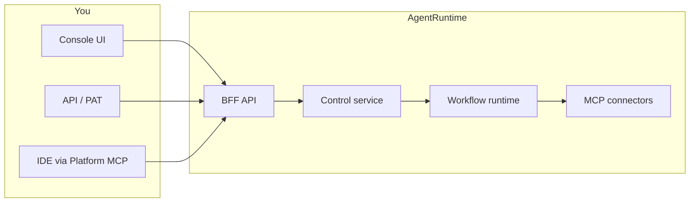

AgentRuntime is an orchestration platform for **production AI agents**. You design multi-step workflows in the Console, connect third-party tools through MCP (Model Context Protocol), run workloads with retries and tracing, and govern access across tenants and projects.

Think of it as **Airflow for AI**: event-driven workflow execution with native tool integration, not a generic chat UI.

## What you can do

- **Design workflows** in Workflow Studio — directed graphs of MCP calls, LLM steps, Lua scripts, loops, and human approvals
- **Connect tools** via 40+ MCP connectors (Google Workspace, databases, Shopify, GitHub, and more)
- **Run reliably** with dry-run validation, versioning, pause/resume, retries, and live event streams
- **Approve in the loop** — human tasks surface in Command Center for review before a run continues
- **Observe usage** — live runs, success rates, step traces, and credit consumption in Analytics
- **Automate via API** — REST endpoints and personal access tokens for CI, scripts, and IDE integrations

## Core components

| Component | What it does |
|-----------|--------------|
| **Console** | Web UI at [console.agentruntime.io](https://console.agentruntime.io) — Workflow Studio, Command Center, Connections, MCP, Providers, Chat |
| **BFF API** | Public API at [api.agentruntime.io](https://api.agentruntime.io) — auth, workflows, runs, billing, integrations |
| **Workflow runtime** | Executes workflow graphs, manages parallelism, retries, and human-in-the-loop pauses |
| **MCP layer** | Catalog of tool servers; tenant **instances** with config profiles and connection bindings |
| **Agent service** | Runs built-in agent turns in chat and channel rooms |
| **Platform MCP** | Exposes Console APIs as MCP tools for IDEs at [mcp.agentruntime.io](https://mcp.agentruntime.io/mcp) |

## How it fits together

## Key concepts

- **Workspace (tenant)** — Your organization. Holds projects, members, billing, and integrations.
- **Project** — Where workflows, runs, and MCP instances live. Roles are scoped per project.
- **Workflow** — A versioned DAG of steps. Authored in Workflow Studio, validated before publish.
- **Run** — One execution of a published workflow snapshot. Streams events over WebSocket.
- **Connection** — Saved credentials (Google OAuth, WhatsApp, API keys) bound to MCP instances.
- **MCP instance** — A deployed tool server in your project with configuration and connection overrides.

See [Key concepts](/platform/key-concepts) for the full model, or jump to the [Quickstart](/platform/quickstart) to create your first workflow.

## Who AgentRuntime is for

AgentRuntime is built for teams moving from AI experiments to **production workloads**:

- Engineering teams automating ops, data, and integration tasks with agent workflows
- Product teams that need human approval gates before agents take action
- Organizations that require multi-tenant access control, usage metering, and audit trails

<Note>
  AgentRuntime is API-first. The Console is the primary operator interface, but every workflow capability is also available through the REST API and Platform MCP for programmatic use.
</Note>
