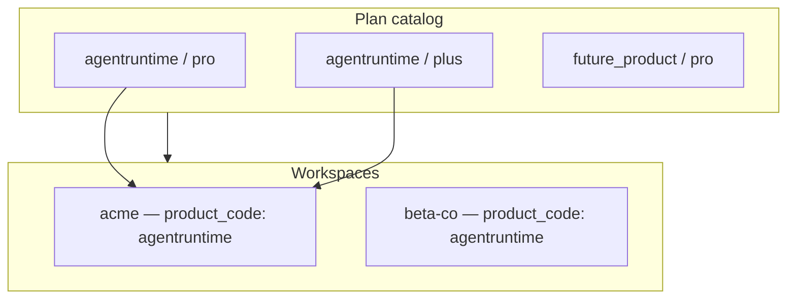

AgentRuntime's billing kernel (**Wheelhouse**) can host **multiple commercial products** on one database. Each product has its own plan catalog, trial policies, and workspace lineage — keyed by **`product_code`**.

The [Console](https://console.agentruntime.io) you use today is scoped to **`agentruntime`**. You do not pick a product in the UI; your deployment's BFF filters plans and onboarding to that code automatically.

## Concepts

| Term | Meaning |
|------|---------|
| **`product_code`** | Stable slug for a commercial product line (`agentruntime`, or a future SaaS on the same platform) |
| **`plan_code`** | Tier within that product (`free`, `pro`, `plus`, `max`, `enterprise`) |
| **Catalog key** | `(product_code, plan_code)` — the same tier name can exist on different products without collision |
| **Workspace** | Each workspace (`tenant`) is stamped with one `product_code` at creation |



## What you see in the Console

For **console.agentruntime.io**:

- **Settings → Plans** lists only **AgentRuntime** plans (`product_code = agentruntime`)
- **Settings → Billing Overview** and **Usage & History** reflect your workspace subscription and credit buckets — unchanged from single-product behavior
- Plan cards show tier names (`pro`, `plus`, …) — not the internal `product_code`

<Note>
  The public BFF filters the catalog using deployment config (`PRODUCT_CODE = agentruntime`). You will not see another product's plans in this Console even though they may share the same Wheelhouse database.
</Note>

### Workspace creation

When you create a workspace on the AgentRuntime Console:

1. The workspace is stored with `product_code = agentruntime`
2. Onboarding auto-trial and default plan selection consider only **agentruntime** catalog rows
3. Your tenant list in the workspace switcher shows only workspaces for **this** product's BFF deploy

A global user account (email / Google) can belong to workspaces on **different** products in the future — each workspace is independent; credits and subscriptions do not cross product boundaries.

## Plans and Stripe

Plans sync from Stripe into Wheelhouse. Each Stripe **Price** or **Product** carries metadata:

| Metadata key | Required | Example |
|--------------|----------|---------|
| `product_code` | Yes (multi-product) | `agentruntime` |
| `plan_code` | Yes | `pro` |
| `included_microcredits_per_cycle` | Recommended | `5000000` |

Sync upserts `plans` and `plan_policies` on **`(product_code, plan_code)`**. Trial length, PAYG rules, and credit gates live in `plan_policies` per pair.

Self-serve tiers for AgentRuntime today:

| plan_code | Typical role |
|-----------|--------------|
| `free` | PAYG-only |
| `pro` | Default onboarding; 14-day trial available |
| `plus` / `max` | Paid subscription tiers |
| `enterprise` | Sales-provisioned |

Annual variants (`pro_annual`, etc.) are separate catalog rows with the same `product_code`.

See [Billing and credits](/platform/billing-and-credits) for buckets, metering, and top-ups.

## Credits and subscriptions

Multi-product does **not** split credits inside one workspace:

| Scope | Behavior |
|-------|----------|
| **Per workspace** | One active plan, trial state, and credit ledger (trial → included → PAYG) |
| **Per product** | Separate plan catalog and policies; workspaces only consume plans from their `product_code` |
| **PAYG balance** | Still persists across plan changes within the same workspace |

Usage metering (`workflow.step.execute`, memory jobs, etc.) debits the workspace ledger the same way regardless of `product_code`.

## API behavior

Customer integrations call **`https://api.agentruntime.io`** — the BFF attaches product scope to Wheelhouse internally:

- `GET /v1/billing/plans` — Returns plans for the deployment's `product_code` only
- `POST /v1/billing/subscription`, trial, and top-up endpoints — Resolve catalog against the workspace's product
- Onboarding and workspace create — Stamp `product_code` from BFF config

The Console-facing plan JSON emphasizes `plan_code`, `amount`, and trial fields. `product_code` is implicit for this deployment (`agentruntime`).

**Sysadmin / operator APIs** can list all products' plans when called with appropriate scope — not exposed in the standard Console.

### Example catalog response shape

`GET /v1/billing/plans` (scoped to AgentRuntime):

```json
{
  "plans": [
    {
      "plan_code": "pro",
      "stripe_price_id": "price_…",
      "amount": 4900,
      "currency": "usd",
      "interval": "month",
      "interval_count": 1,
      "product_name": "AgentRuntime Pro",
      "trial_enabled": true,
      "trial_days": 14,
      "trial_credits_granted": 5000000,
      "trial_requires_card": false,
      "onboarding_default": true
    }
  ]
}
```

Values like `trial_credits_granted` are in **microcredits**. See [API examples](/api/examples#billing-usage-snapshot).

## Migration (existing workspaces)

Production migrated existing data with `product_code = 'agentruntime'` on:

- All workspaces (`tenant.product_code`)
- All `plans` / `plan_policies` rows
- Pending signup rows

**No action required** for current customers. Plan codes (`pro`, `plus`, …) and credit balances are unchanged.

## Future second product on the platform

When another product launches on the shared Wheelhouse kernel:

| Area | Expected behavior |
|------|-------------------|
| **Console URL** | Separate BFF deploy with its own `PRODUCT_CODE` and DNS (for example `console.otherproduct.io`) |
| **Plans** | That Console shows only its product's catalog |
| **Users** | Same email can create a workspace on each product; memberships are per workspace |
| **Stripe** | Typically one Stripe account per Wheelhouse environment; prices distinguished by `product_code` metadata |
| **Referrals** | Program rules may gain per-product configuration later |

Hostname → `product_code` routing on a **single** shared BFF is explicitly **out of scope** for v1 — product is determined by deployment config, not by request Host header.

## What stays shared

One Wheelhouse environment still shares:

- Stripe webhook endpoint and account (unless you adopt Connect per product)
- Global `User` identity in the auth realm
- Instance-level kill switches (for example `TRIALS_ENABLED` in Wheelhouse config)

Tenant-scoped tables (projects, workflows, usage events, PATs) inherit product through **`tenant.product_code`** — they do not duplicate the column.

## Troubleshooting

| Question | Answer |
|----------|--------|
| Why don't I see `product_code` in the Console? | It's a platform partition key, not a user setting. This Console is AgentRuntime only. |
| Can I move a workspace to another product? | Not self-serve. Products are fixed at workspace creation. |
| Do plan codes collide across products? | No — catalog uniqueness is `(product_code, plan_code)`. |
| Which source of truth for my plan? | **Settings → Plans** and `GET /v1/billing/plans` on your Console's API host. |

## Related

- [Billing and credits](/platform/billing-and-credits) — credits, trials, PAYG, metering
- [Key concepts — workspaces](/platform/key-concepts#workspaces-tenants)
- [Referrals and affiliates](/platform/referrals-and-affiliates)
- [API reference — billing](/api/reference#billing-endpoints)
- [API examples](/api/examples)
