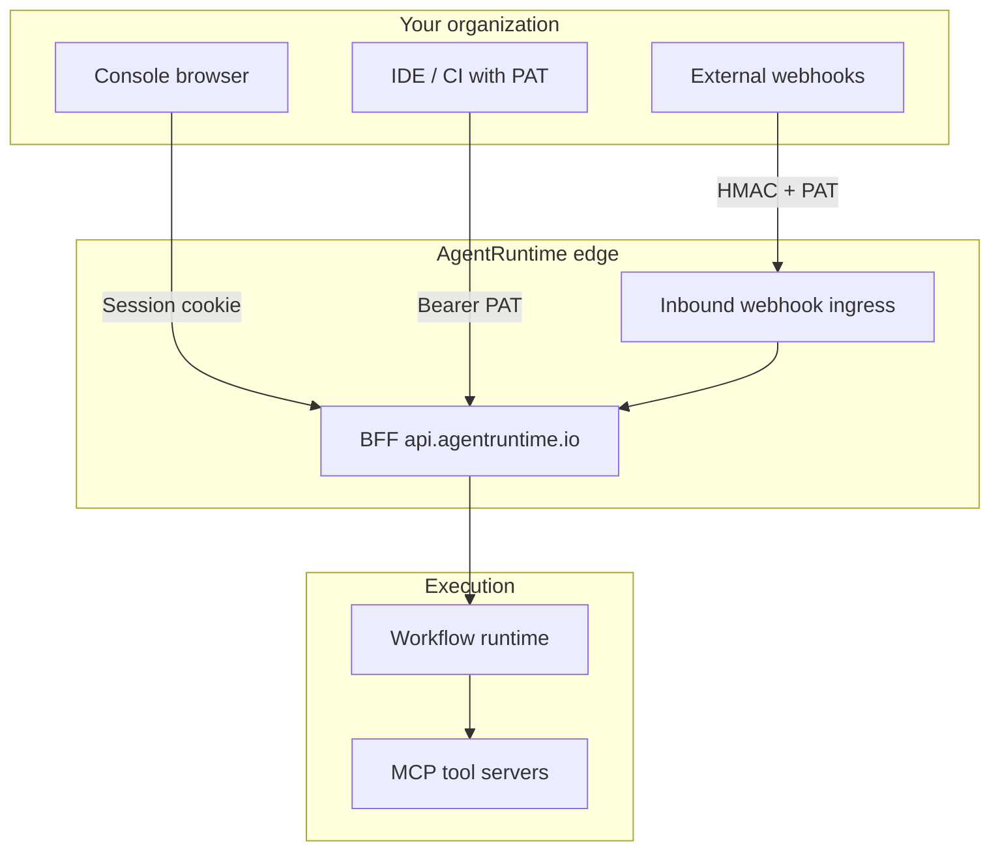

AgentRuntime is a multi-tenant platform for running AI agent workflows. This page summarizes security practices for builders and enterprise evaluators. It is an overview — not a contractual commitment. Binding terms live in the legal policies linked below.

## Architecture overview

- **Console** — Session cookies scoped to `.agentruntime.io`; HTTPS only in production
- **REST / Platform MCP** — Personal access tokens with scoped permissions
- **Inbound webhooks** — HMAC-signed body + automation PAT; no session cookie on public ingress
- **Workflow runs** — Execute in tenant-scoped projects with role checks on every API call

Customer integrations should always use **`https://api.agentruntime.io`**. Do not call internal service URLs directly.

## Tenant isolation

| Layer | Isolation |
|-------|-----------|
| **Workspace (tenant)** | Billing, members, vault paths, and default project scope |
| **Project** | Workflows, runs, MCP instances, connections, inbound subscriptions |
| **Roles** | `tenant_admin`, `project_admin`, `project_contributor`, `project_viewer` — see [Roles and permissions](/platform/roles-permissions) |

API requests require `X-Tenant-Id` and `X-Project-Id` for scoped operations. PATs are validated against user identity and project role.

## Secrets and credentials

| Secret type | Storage | Console path |
|-------------|---------|--------------|
| Connector API keys | Vault-backed **Connections** | **Connections** |
| LLM vendor keys | Vault-backed **Providers** | **Providers** |
| Automation PATs | Vault-backed API keys | **Settings → API keys** |
| Webhook signing secrets | Shown once at subscription create | **Workflow → Inbound** |
| Workspace vault paths | Tenant vault | **Settings** (admins) |

**Do not** embed secrets in workflow graphs, Lua scripts, or client-side code. Use connections and provider keys.

Rotate compromised tokens immediately: revoke in the Console, audit recent runs, and create replacements.

## Authentication

- **Email + password** with verification for new accounts
- **Google OAuth** (Sign in with Google / One Tap)
- **PATs** for CI, scripts, inbound webhook automation, and Platform MCP
- **Domain verification** — Tenant admins can restrict workspace access to verified email domains

See [API authentication](/api/authentication) and [Workspace settings](/platform/settings).

## Inbound webhook security

External senders must provide:

- `Authorization: Bearer pat_…` (automation PAT bound to the subscription)
- `X-Agentruntime-Signature: sha256=<hmac-sha256 of raw body>` using the signing secret

AgentRuntime rejects requests with invalid signatures, expired skew, or missing auth before starting a run. See [Inbound webhooks](/integrations/inbound-webhooks).

## Data handling

| Data | Notes |
|------|-------|
| **Workflow graphs** | Stored per project; published versions are immutable snapshots |
| **Run events** | Step inputs/outputs logged for observability and Command Center |
| **LLM prompts** | Sent to the model provider you configure (tenant or platform key) |
| **MCP tool calls** | Executed against your bound connections; third-party adapters follow their vendor policies |
| **Billing ledger** | Usage events and credit debits in Wheelhouse |

Memory indexing and search are **preview** — see [Memory](/ai/memory) and [Feature availability](/platform/feature-availability).

## Compliance posture

AgentRuntime is **not** certified for regulated workloads out of the box. Evaluate against your requirements:

| Topic | Current guidance |
|-------|------------------|
| **HIPAA / PHI** | Do not use the **healthcare** connector in production — mock APIs only. Do not store PHI in workflows without a BAA and architecture review. |
| **PCI** | Do not pass cardholder data through workflow input or MCP tools. Use Stripe Checkout for payments. |
| **SOC 2 / ISO** | Contact sales for current attestation status and security packet. |
| **Data residency** | Discuss deployment region and subprocessors with sales for enterprise contracts. |
| **AI subprocessors** | LLM calls route to vendors you configure (OpenAI, Anthropic, Google, etc.). Review their DPAs. |

For security questionnaires, vulnerability reports, or enterprise reviews, use [agentruntime.io/contact](https://agentruntime.io/contact) and select the appropriate topic (security / enterprise).

## Shared responsibility

| You are responsible for | AgentRuntime is responsible for |
|-------------------------|--------------------------------|
| PAT and webhook secret hygiene | Platform patching and edge TLS |
| Connector credential scope (least privilege) | Tenant-scoped API authorization |
| Workflow logic and data minimization | Vault storage for configured secrets |
| External webhook sender integrity | Signature verification on ingress |
| LLM prompt content and PII policies | Metering and audit of billable actions |

## Legal policies

Review the current policies on the marketing site:

| Policy | URL |
|--------|-----|
| Privacy | [agentruntime.io/legal/privacy-policy](https://agentruntime.io/legal/privacy-policy) |
| Terms of service | [agentruntime.io/legal/terms-of-service](https://agentruntime.io/legal/terms-of-service) |
| Billing and credits | [agentruntime.io/legal/billing](https://agentruntime.io/legal/billing) |

Additional policies may appear under [agentruntime.io/legal/](https://agentruntime.io/legal/privacy-policy) as the product evolves.

## Reporting security issues

Report vulnerabilities responsibly via [agentruntime.io/contact](https://agentruntime.io/contact) — do not post exploit details in public issues. Include reproduction steps and impact assessment.

## Related

- [Roles and permissions](/platform/roles-permissions)
- [API authentication](/api/authentication)
- [Troubleshooting](/platform/troubleshooting)
- [Billing and credits](/platform/billing-and-credits)
