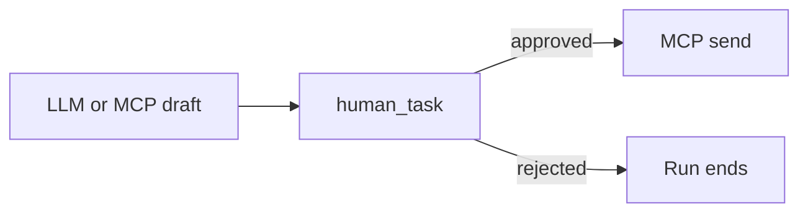
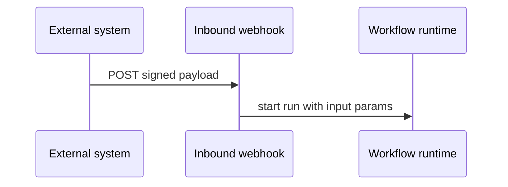
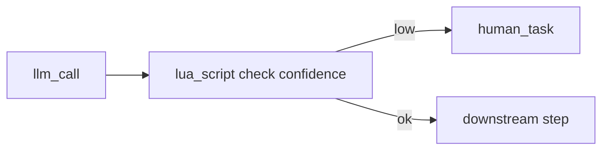

These patterns combine step types, Command Center, and integrations into workflows you can adapt for production. See the [JSON cookbook](/workflows/json-schema-cookbook) for full graph examples.

## Approve then send

Pause before any outbound action that affects customers or production data.



### Graph structure

1. **Draft step** — `llm_call` or `mcp_call` generates content (email body, WhatsApp message, CRM update payload)
2. **human_task** — `task_type: "approval"` with draft in `task_payload`
3. **Send step** — `mcp_call` to `gmail` (`send_email`), `whatsapp` (`send_message`), or another connector — `depends_on` the human task, uses approved payload

### Example human task payload

```json
{
  "task_type": "approval",
  "task_payload": {
    "title": "Send order confirmation",
    "description": "Review before sending to {{input.customer_email}}",
    "draft_subject": "{{steps.draft-email.result.subject}}",
    "draft_body": "{{steps.draft-email.result.body}}"
  }
}
```

Complete approvals from [Command Center](/workflows/command-center). Downstream steps read the completion result.

<Warning>
  Do not skip the human task for regulated or high-risk outbound messaging. A rejected task stops the branch — design downstream steps to handle rejection gracefully or use `condition` to branch.
</Warning>

## Inbound webhook triggers

Start workflows from external systems (CRM, payment processor, monitoring alert).



### Setup

1. Create a workflow whose first step validates `{{input.*}}` fields
2. Create an inbound webhook subscription — see [Inbound webhooks](/integrations/inbound-webhooks)
3. Configure the external system to POST to the subscription URL with the signing secret
4. Map POST body fields to workflow input

### Validate-first pattern

Always validate required input before calling external tools:

```json
{
  "id": "validate-input",
  "type": "lua_script",
  "name": "Validate webhook payload",
  "script": "if not input.order_id then error('order_id required') end\nreturn { order_id = input.order_id }",
  "timeout_s": 5
}
```

Or use `condition` on downstream steps: `"condition": "{{input.order_id}}"`

### Idempotency

External systems may retry webhooks. Design workflows to be idempotent:

- Check if the order/event was already processed (MCP query step)
- Use external IDs in `tool_args` so duplicate runs do not double-send

<Note>
  AgentRuntime does not provide built-in cron scheduling today. For recurring runs, use an external scheduler that calls the API or fires an inbound webhook on a timetable.
</Note>

## Error handling with retries

### Per-step retries

Set `retry_count` on steps that call flaky external APIs:

```json
{
  "id": "fetch-data",
  "type": "mcp_call",
  "name": "Fetch from API",
  "tool_name": "postgres_query",
  "retry_count": 3,
  "timeout_s": 30
}
```

The runtime retries after failure up to `retry_count` times before marking the step failed.

### Timeouts

Set `timeout_s` on every external call. Defaults are not unlimited — long-running MCP or LLM calls without timeouts can stall runs.

| Step type | Suggested starting timeout |
|-----------|---------------------------|
| MCP tool call | 30–120s depending on API |
| LLM call | 60–180s for long generations |
| Lua script | 5–30s (hard cap 30s) |
| for_each | Sum of body timeouts × parallelism |

### Failure propagation

When a step fails after retries:

- The run marks the step `failed`
- Downstream steps that `depends_on` the failed step are skipped
- The run appears in Command Center **Failed recently**

Recover by fixing the root cause (connection, credits, tool args), publishing a new workflow version if needed, and starting a new run.

### Human escalation on failure

Route low-confidence or failed LLM output to human review instead of failing silently:



Use `condition` or a Lua branch to set a flag, then add a `human_task` on the low-confidence path.

## Parallel fan-out

Use `for_each` to process a list with bounded parallelism:

```json
{
  "id": "notify-each",
  "type": "for_each",
  "for_each_items": "{{steps.fetch-recipients.result.contacts}}",
  "for_each_max_parallel": 5,
  "for_each_body": {
    "type": "mcp_call",
    "tool_name": "send_message",
    "tool_args": {
      "to": "{{foreach.item.phone}}",
      "body": "{{steps.build-template.result.text}}"
    },
    "timeout_s": 30
  }
}
```

Keep `for_each_max_parallel` low for rate-limited APIs (WhatsApp, email providers).

## Memory-enriched steps

When memory is enabled, workflow prepare-step can inject long-term context before LLM steps. See [Memory](/ai/memory) (preview). Pattern:

1. Index conversations or files into memory
2. LLM step prompt references memory search results passed via prepare-step context
3. Human task approves actions informed by retrieved knowledge

## Pattern checklist

| Pattern | Human task? | Retries? | Trigger |
|---------|-------------|----------|---------|
| Approve then send | Yes | On draft step optional | Manual / API |
| Webhook automation | Optional | On MCP steps | Inbound webhook |
| Scheduled report | Optional | On extract steps | External cron → API |
| Bulk processing | Optional | On for_each body | API / webhook |

## End-to-end guides

These patterns are expanded into full step-by-step recipes in **Guides**:

- [Form webhook → Postgres → Resend digest](/guides/form-webhook-postgres-resend-digest)
- [Shopify order → WhatsApp template](/guides/shopify-order-whatsapp)
- [GitHub PR → LLM review → comment](/guides/github-pr-review)
- [Scheduled Postgres → Gmail report](/guides/scheduled-postgres-gmail-report)
- [Lead webhook → ActiveCampaign + Notion](/guides/lead-sync-activecampaign-notion)

See [all guides](/guides/overview).

## Related docs

- [Command Center](/workflows/command-center) — approve tasks and monitor runs
- [Human tasks](/workflows/human-tasks) — task authoring reference
- [Inbound webhooks](/integrations/inbound-webhooks) — external triggers
- [Connector catalog — common patterns](/integrations/connector-catalog#common-patterns)
- [Troubleshooting](/platform/troubleshooting) — recover from failures
